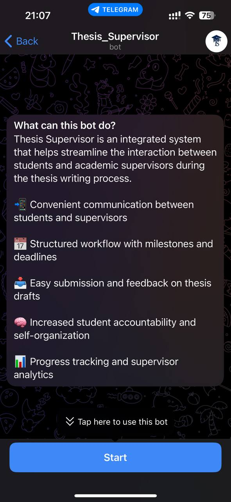
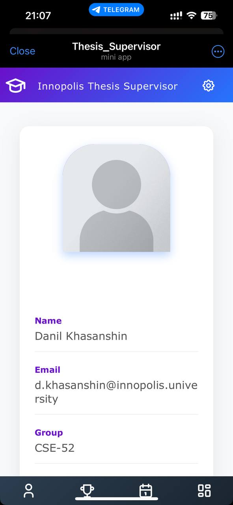
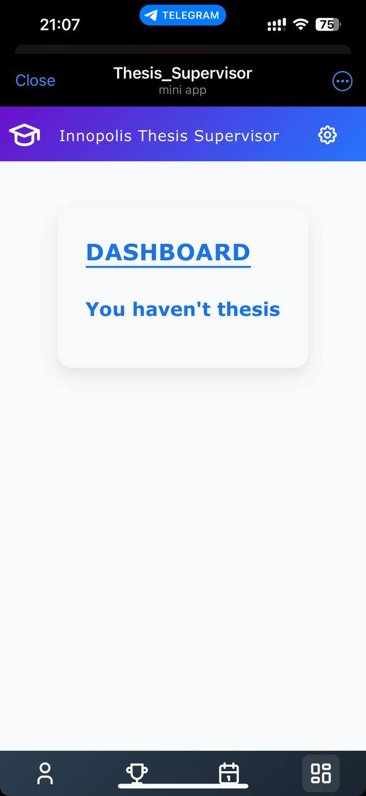
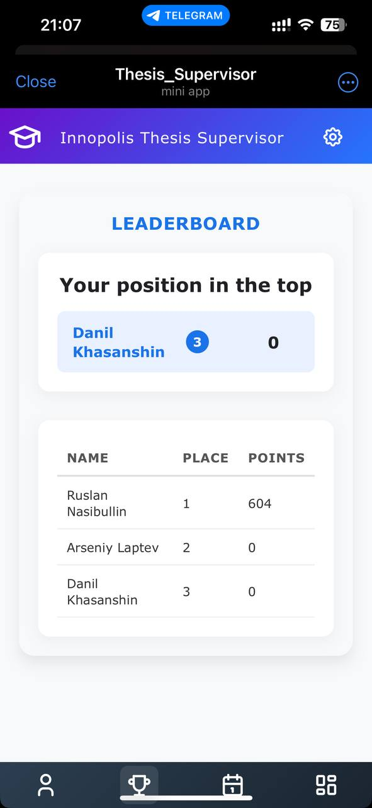

# Thesis Supervisor

<p align="center">
   
</p>

*A system for managing thesis supervision, connecting students and supervisors through Telegram interfaces.*

## 🚀 Quick Links

- **🌐 Live Demo**: [Telegram Bot](https://t.me/Thesis_Supervisor_bot)
- **📹 Demo Video**: [Google Drive](https://drive.google.com/drive/folders/1ii8QsEvj0mLV1381QXRV-TJbpyOlJN7m?hl=ru)
- **📚 Documentation**: [docs/](docs/)

## Project Goals and Description

The Thesis Supervisor System is designed to streamline the thesis supervision process in academic institutions. Our primary goals include:

- **🎯 Efficient Supervision**: Provide a centralized platform for thesis supervision management
- **🔗 Seamless Communication**: Enable real-time communication between students and supervisors
- **📊 Progress Tracking**: Offer comprehensive tools for monitoring thesis progress
- **🤖 Multi-Platform Access**: Support both web and Telegram interfaces for maximum accessibility
- **📈 Analytics & Reporting**: Generate insights on supervision effectiveness and student progress

The system addresses the common challenges in thesis supervision: scattered communication, lack of progress visibility, and inefficient coordination between students and supervisors.

## 📸 Product Screenshots (for customer)

> *Visual clarity is essential for understanding the product's interface and functionality. This section provides real screenshots from the current version of the system to help customers and stakeholders preview the user experience.*

### Telegram Bot

<p align="center">
  
</p>

### BackOffice

<p align="center">
  
</p>

### MiniApp

<p align="center">
  
  
  
</p>

## Feature Roadmap

### ✅ Implemented Features

- [x] **User Authentication & Registration**
  - Email verification system
  - Role-based access control (Student/Supervisor)
  
- [x] **Web Application**
  - Modern React frontend with responsive design
  - Student and supervisor profile management
  - Dashboard for progress tracking
  
- [x] **Telegram Integration**
  - Telegram bot for mobile access
  - Mini-app interface within Telegram
  - Real-time notifications

- [x] **Database Infrastructure**
  - SQLite database with SQLAlchemy ORM
  - User management and session handling
  - Data persistence and migrations

- [x] **Quality Assurance**
  - Automated testing framework
  - User acceptance tests
  - Continuous integration pipeline

- [x] **Advanced Communication Features**
  - File sharing system
  - Meeting scheduling
  - Submission button

- [x] **Enhanced Analytics**
  - Performance metrics dashboard

### 📋 Planned Features

- [ ] **Integration Capabilities**
  - LMS integration (Moodle, Canvas)
  - Google Calendar sync

- [ ] **Advanced Features**
  - AI-powered feedback suggestions
  - Plagiarism detection

## Usage Instructions

### Quick Start Guide

1. **Access the Application**
   - Telegram: Search for `@thesis_supervisor_bot` and press `/start`
   - Verify email address

2. **Student Registration**
   - Click "Register as Student"
   - Fill out profile information
   - Wait for supervisor assignment

3. **Supervisor Access**
   - Login with institutional credentials
   - Review assigned students
   - Set up supervision schedule and milestones

4. **Daily Usage**
   - Track thesis progress through dashboard
   - Communicate via integrated messaging
   - Submit and review documents
   - Schedule meetings and deadlines

## Installation and Deployment

### Prerequisites

- Python 3.8 or higher
- Node.js 16+ (for frontend development)
- SQLite (included with Python)
- Git

### Local Development Setup

1. **Clone the Repository**
   ```bash
   git clone https://github.com/your-username/thesis_supervisor.git
   cd thesis_supervisor
   ```

2. **Backend Setup**
   ```bash
   # Create virtual environment
   python -m venv venv
   source venv/bin/activate  # On Windows: venv\Scripts\activate
   
   # Install dependencies
   pip install -r requirements.txt
   
   # Initialize database
   python app/Infrastructure/DataBase/init_db.py
   ```

3. **Frontend Setup**
   ```bash
   cd app/front
   npm install
   npm run dev
   ```

4. **Environment Configuration**
   ```bash
   # Create .env file
   cp .env.example .env
   # Edit .env with your configuration
   ```

5. **Run the Application**
   ```bash
   # Start backend
   python app/main.py
   
   # Start frontend (in another terminal)
   cd app/front
   npm run dev
   ```

## Documentation

### 📋 Development
- [Contributing Guidelines](CONTRIBUTING.md)
- [Git Workflow](docs/development/git-workflow.md)
- [Secrets Management](docs/development/secrets-management.md)

### 🎯 Quality Assurance
- [Quality Attribute Scenarios](docs/quality-attributes/quality-attribute-scenarios.md)
- [Automated Tests](docs/quality-assurance/automated-tests.md)
- [User Acceptance Tests](docs/quality-assurance/user-acceptance-tests.md)

### 🔧 Build and Deployment
- [Continuous Integration](docs/automation/continuous-integration.md)

### 🏗️ Architecture
- [Architecture Overview](docs/architecture/architecture.md)
- [Static View](docs/architecture/static-view.md)
- [Dynamic View](docs/architecture/dynamic-view.md)
- [Deployment View](docs/architecture/deployment-view.md)

## License

This project is licensed under the MIT License - see the [LICENSE](LICENSE) file for details.

## Support

- 📧 Email: markdajver@gmail.com
- 🐛 Issues: [GitHub Issues](https://github.com/CAA-PdzLPn-TVrzhK/Thesis_Supervisor/issues)

---

*Built with ❤️ by the Thesis Supervisor Team*
