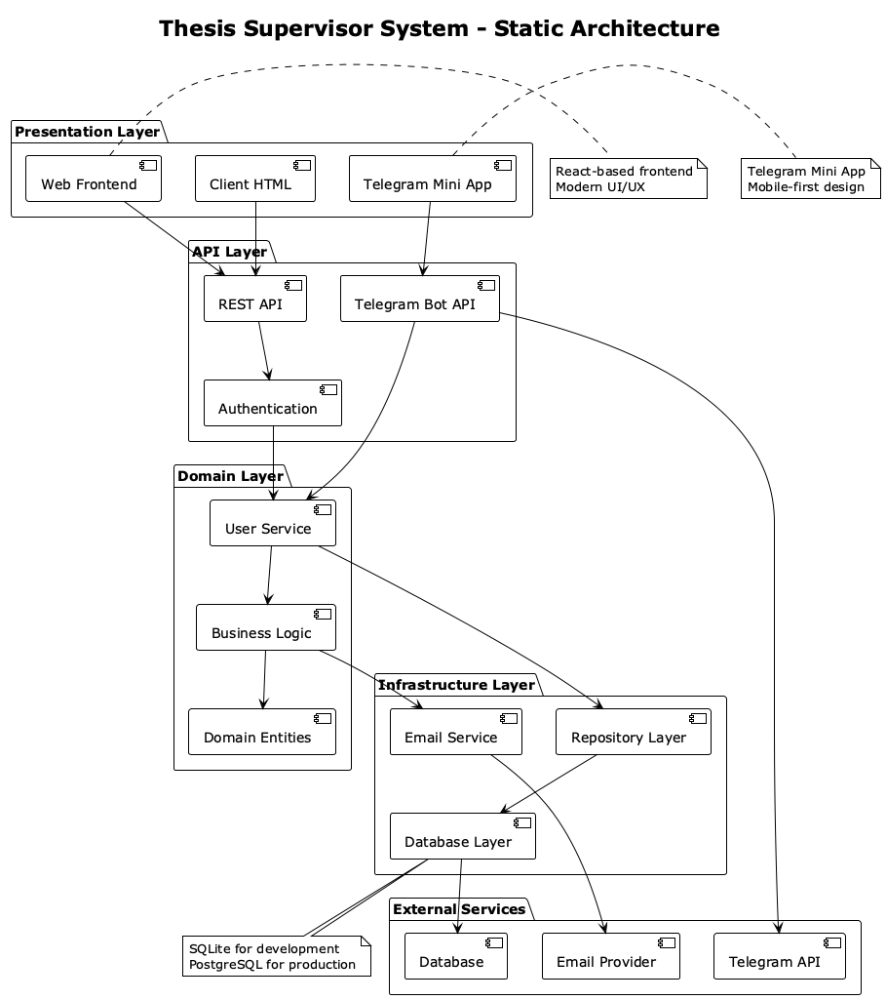
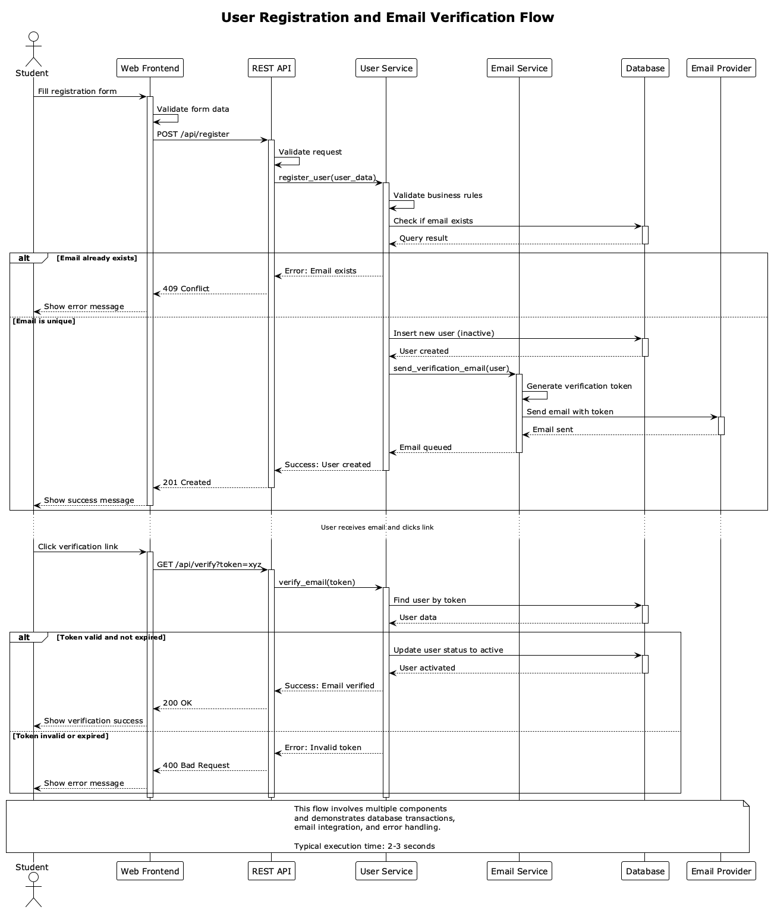
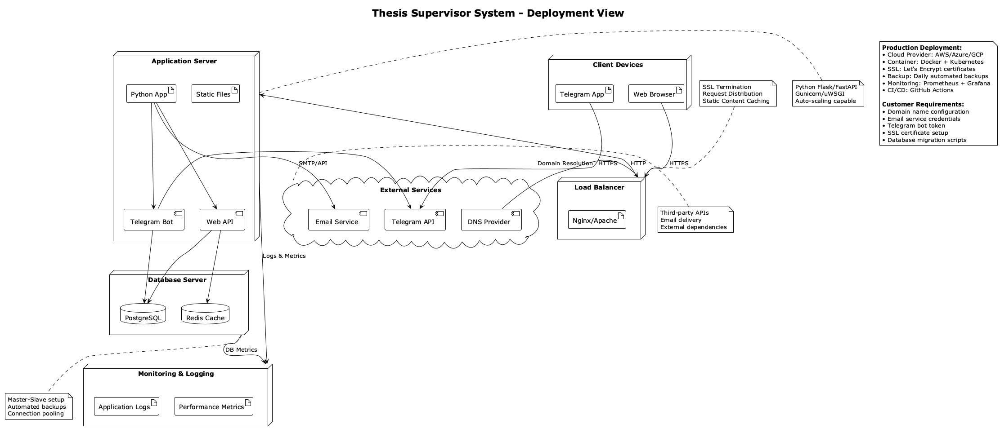
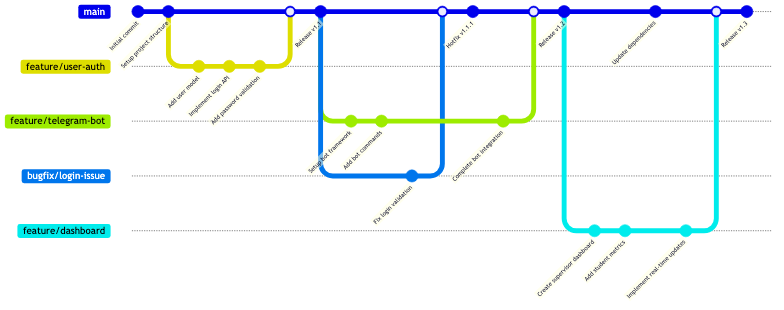

# Thesis Supervisor System

A comprehensive system for managing thesis supervision, connecting students and supervisors through web and Telegram interfaces.

## Usage

### Authentication & Access
The system provides multiple access points:

1. **Web Application**: Access the main application at [Frontend URL]
   - Default admin credentials:
     - Username: `admin`
     - Password: `admin123`

2. **Telegram Mini App**: Access through the integrated Telegram bot
   - Bot username: `@thesis_supervisor_bot`
   - Use `/start` command to begin

### Getting Started
1. **For Students**:
   - Register through the web interface or Telegram bot
   - Complete your profile information
   - Connect with your assigned supervisor
   - Track your thesis progress through the dashboard

2. **For Supervisors**:
   - Access the supervisor panel through the web interface
   - Review student profiles and progress
   - Schedule meetings and set milestones
   - Provide feedback on submissions

3. **System Requirements**:
   - Python 3.8+
   - SQLite database
   - Modern web browser
   - Telegram account (for mobile access)

### Running the Application

```bash
# Clone the repository
git clone [repository-url]
cd thesis_supervisor

# Install dependencies
pip install -r requirements.txt

# Initialize database
python app/Infrastructure/DataBase/init_db.py

# Run the application
python app/main.py
```

## Architecture

### Static View
The system follows a layered architecture pattern with clear separation of concerns:



**Components:**
- **Presentation Layer**: Web frontend (React) and Telegram Mini App
- **API Layer**: RESTful APIs and Telegram Bot integration
- **Domain Layer**: Business logic and entities
- **Infrastructure Layer**: Database access, email verification

**Design Decisions:**
- **Layered Architecture**: Ensures maintainability by separating concerns
- **Repository Pattern**: Abstracts data access for better testability
- **Service Layer**: Encapsulates business logic

The cohesion within each layer is high, with related functionality grouped together. Coupling between layers is minimal, achieved through well-defined interfaces.

### Dynamic View
The following sequence diagram shows the user registration and verification process:



**Registration Flow:**
1. User submits registration form
2. System validates input data
3. Database stores user information
4. Email verification service sends confirmation
5. User confirms email
6. System activates account

**Performance:** This scenario typically takes 2-3 seconds in production environment.

### Deployment View


**Deployment Strategy:**
- **Application Server**: Single server deployment for MVP
- **Database**: SQLite for development, PostgreSQL recommended for production
- **Static Assets**: Served directly by application server
- **Telegram Integration**: Webhook-based communication

**Customer Deployment:**
1. Deploy to cloud provider (AWS/Azure/GCP)
2. Configure domain and SSL certificates
3. Set up Telegram webhook
4. Configure email service credentials

## Development

### Kanban Board
Project management is tracked using [GitHub Projects Board](https://github.com/user/thesis_supervisor/projects/1)

**Column Entry Criteria:**
- **Backlog**: New features/bugs identified but not yet prioritized
- **To Do**: Prioritized items ready for development, estimated and assigned
- **In Progress**: Actively being worked on by team member
- **Code Review**: Implementation complete, awaiting peer review
- **Testing**: Code merged, undergoing QA testing
- **Done**: Feature complete and deployed to production

### Git Workflow
We follow a **GitHub Flow** adapted for our team:

#### Branch Strategy
- **main**: Production-ready code
- **feature/[issue-number]-[short-description]**: Feature development
- **bugfix/[issue-number]-[short-description]**: Bug fixes
- **hotfix/[issue-number]-[short-description]**: Critical production fixes

#### Rules and Processes

**Issue Management:**
- Create issues using provided templates
- Label issues: `bug`, `feature`, `enhancement`, `documentation`
- Assign issues to team members during sprint planning

**Branching:**
- Create feature branches from `main`
- Branch naming: `feature/123-user-authentication`
- One branch per issue

**Commit Messages:**
Follow conventional commits format:
```
type(scope): description

[optional body]

[optional footer]
```

**Pull Requests:**
- Use PR template for all submissions
- Require at least 1 approval before merging
- All CI checks must pass
- Squash merge to main

**Code Reviews:**
- Review for code quality, security, and functionality
- Check test coverage
- Verify documentation updates



### Secrets Management
**Security Policy:**
- **Environment Variables**: Store sensitive data in `.env` files (not committed)
- **Production Secrets**: Use cloud provider secret management (AWS Secrets Manager, Azure Key Vault)
- **Database Credentials**: Never hardcode, use environment variables
- **API Keys**: Stored in secure vaults, rotated regularly

**Secret Storage Locations:**
- Development: Local `.env` files
- Staging/Production: Cloud secret management services
- CI/CD: Repository secrets (GitHub Secrets)

## Quality Assurance

### User Acceptance Tests
Comprehensive user acceptance tests are documented in [User Acceptance Tests](docs/quality-assurance/user-acceptance-tests.md)

### Quality Attribute Scenarios
Quality characteristics and scenarios are detailed in [Quality Attribute Scenarios](docs/quality-assurance/quality-attribute-scenarios.md)

### Automated Tests

**Testing Tools:**
- **Unit Tests**: pytest
- **Integration Tests**: pytest with test database
- **Code Coverage**: pytest-cov
- **Linting**: flake8, black
- **Security**: bandit

**Test Types Implemented:**
- **Unit Tests**: Located in `app/Tests/test_*.py`
- **Integration Tests**: Database and API integration tests
- **End-to-End Tests**: User workflow testing

**Test Locations:**
- Unit tests: `app/Tests/`
- Integration tests: `app/Tests/test_integration.py`
- Test configuration: `pytest.ini`

## Build and Deployment

### Continuous Integration
Our CI/CD pipeline is implemented using GitHub Actions:

**Pipeline Stages:**
1. **Lint**: Code quality checks (flake8, black)
2. **Test**: Run all automated tests
3. **Security**: Security vulnerability scanning
4. **Build**: Package application
5. **Deploy**: Deploy to staging/production environments

**CI Configuration:**
- Workflow file: `.github/workflows/ci.yml`
- Triggers: Push to main, pull requests
- Test matrix: Python 3.8, 3.9, 3.10
- Coverage reporting: Codecov integration

**Deployment Process:**
- Automatic deployment to staging on merge to main
- Manual approval required for production deployment
- Blue-green deployment strategy for zero downtime
- Rollback capability for quick recovery
