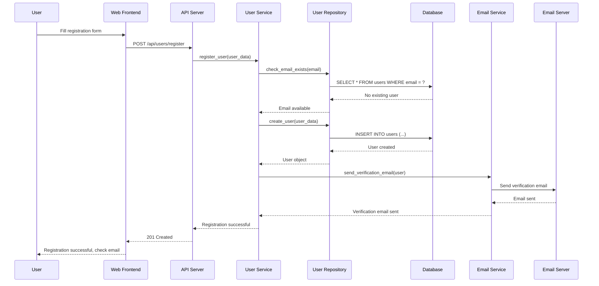
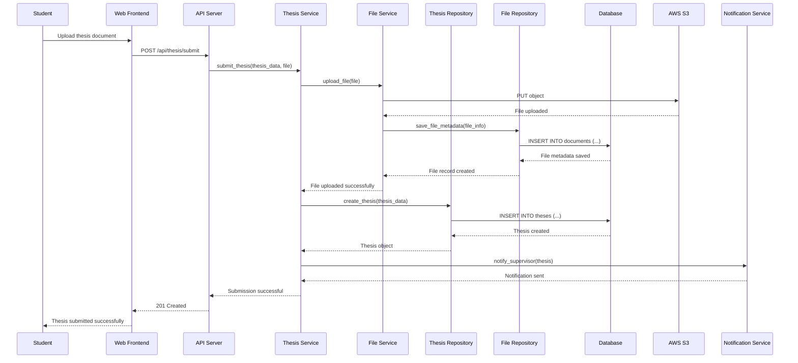
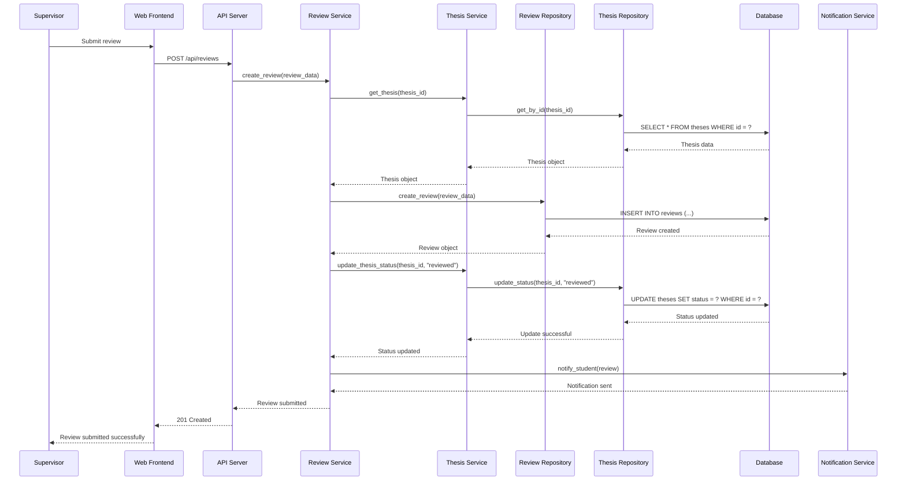
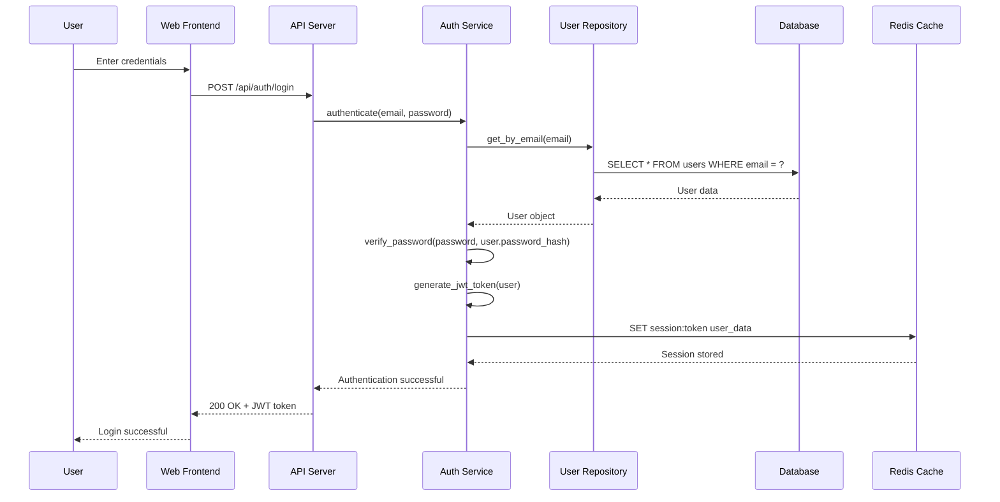

# Architecture Documentation

This document provides a comprehensive overview of the Thesis Supervisor System architecture, including static, dynamic, and deployment views.

## System Overview

The Thesis Supervisor System is a web-based application designed to facilitate thesis supervision in academic institutions. The system connects students with supervisors through multiple interfaces and provides comprehensive tools for managing the thesis supervision process.

### Key Architectural Goals

- **Scalability**: Support growing user base and increasing thesis submissions
- **Reliability**: Ensure 99.9% uptime with robust error handling
- **Security**: Protect sensitive academic data and user information
- **Maintainability**: Enable easy updates and feature additions
- **Performance**: Provide responsive user experience under load
- **Extensibility**: Allow integration with external systems

## Tech Stack

### Backend Technologies

| Component | Technology | Version | Purpose |
|-----------|------------|---------|---------|
| **Runtime** | Python | 3.9+ | Core application runtime |
| **Web Framework** | FastAPI | 0.104.1 | RESTful API development |
| **Database** | PostgreSQL | 13+ | Primary data storage |
| **ORM** | SQLAlchemy | 2.0+ | Database abstraction layer |
| **Authentication** | JWT | PyJWT 2.8+ | User authentication |
| **Caching** | Redis | 7.0+ | Session and data caching |
| **Task Queue** | Celery | 5.3+ | Background task processing |
| **Email** | SMTP | Built-in | Email notifications |
| **File Storage** | AWS S3 | boto3 | Document storage |

### Frontend Technologies

| Component | Technology | Version | Purpose |
|-----------|------------|---------|---------|
| **Framework** | React | 18.2+ | User interface |
| **Build Tool** | Vite | 4.4+ | Development and build |
| **Styling** | Tailwind CSS | 3.3+ | UI styling |
| **State Management** | React Query | 4.32+ | Server state management |
| **Routing** | React Router | 6.15+ | Client-side routing |
| **Forms** | React Hook Form | 7.45+ | Form handling |
| **HTTP Client** | Axios | 1.5+ | API communication |
| **Testing** | Jest + Testing Library | Latest | Unit and integration testing |

### Infrastructure Technologies

| Component | Technology | Purpose |
|-----------|------------|---------|
| **Containerization** | Docker | Application packaging |
| **Orchestration** | AWS ECS | Container orchestration |
| **Load Balancer** | AWS ALB | Traffic distribution |
| **CDN** | AWS CloudFront | Content delivery |
| **Monitoring** | AWS CloudWatch | System monitoring |
| **CI/CD** | GitHub Actions | Continuous integration |
| **IaC** | Terraform | Infrastructure management |
| **Security** | AWS IAM | Access control |

### External Integrations

| Service | Purpose | Integration Method |
|---------|---------|-------------------|
| **Telegram Bot API** | Mobile interface | REST API |
| **Email Service** | SMTP notifications | SMTP protocol |
| **University LMS** | Student data sync | REST API |
| **Document Storage** | File management | AWS S3 API |
| **Authentication** | SSO integration | OAuth 2.0 |

## Static View

### System Architecture

```
┌─────────────────────────────────────────────────────────────────┐
│                          Client Layer                           │
├─────────────────────────────────────────────────────────────────┤
│  Web Browser  │  Telegram Bot  │  Mobile App  │  Admin Panel   │
└─────────────────────────────────────────────────────────────────┘
                                  │
                                  ▼
┌─────────────────────────────────────────────────────────────────┐
│                      API Gateway Layer                          │
├─────────────────────────────────────────────────────────────────┤
│           FastAPI Application Server (REST API)                 │
│                     Authentication Middleware                   │
│                       Rate Limiting                             │
│                        CORS Handler                             │
└─────────────────────────────────────────────────────────────────┘
                                  │
                                  ▼
┌─────────────────────────────────────────────────────────────────┐
│                      Service Layer                              │
├─────────────────────────────────────────────────────────────────┤
│  User Service  │  Thesis Service  │  Notification Service      │
│  Auth Service  │  Review Service  │  Email Service             │
│  Admin Service │  Report Service  │  File Service              │
└─────────────────────────────────────────────────────────────────┘
                                  │
                                  ▼
┌─────────────────────────────────────────────────────────────────┐
│                     Repository Layer                            │
├─────────────────────────────────────────────────────────────────┤
│  User Repository  │  Thesis Repository  │  Notification Repo   │
│  Auth Repository  │  Review Repository  │  File Repository     │
└─────────────────────────────────────────────────────────────────┘
                                  │
                                  ▼
┌─────────────────────────────────────────────────────────────────┐
│                      Data Layer                                 │
├─────────────────────────────────────────────────────────────────┤
│  PostgreSQL  │  Redis Cache  │  AWS S3  │  Email Server       │
│  (Primary)   │  (Sessions)   │  (Files) │  (Notifications)    │
└─────────────────────────────────────────────────────────────────┘
```

### Component Responsibilities

#### Presentation Layer
- **Web Frontend**: React-based user interface for students and supervisors
- **Telegram Bot**: Mobile interface for notifications and basic operations
- **Admin Panel**: Management interface for system administrators

#### API Layer
- **FastAPI Server**: REST API endpoints for all system operations
- **Authentication Middleware**: JWT-based user authentication
- **Rate Limiting**: Request throttling and abuse prevention
- **CORS Handler**: Cross-origin request management

#### Service Layer
- **User Service**: User management, registration, and profiles
- **Thesis Service**: Thesis submission, tracking, and management
- **Notification Service**: Email and push notifications
- **Authentication Service**: Login, logout, and session management
- **File Service**: Document upload, storage, and retrieval
- **Review Service**: Supervisor reviews and feedback

#### Repository Layer
- **User Repository**: User data access and manipulation
- **Thesis Repository**: Thesis data management
- **Notification Repository**: Notification history and preferences
- **File Repository**: File metadata and storage management

#### Data Layer
- **PostgreSQL**: Primary relational database
- **Redis**: Session storage and caching
- **AWS S3**: Document and file storage
- **Email Server**: SMTP for notifications

### Domain Model

```
┌─────────────────┐    ┌─────────────────┐    ┌─────────────────┐
│      User       │    │     Thesis      │    │     Review      │
├─────────────────┤    ├─────────────────┤    ├─────────────────┤
│ - id: UUID      │    │ - id: UUID      │    │ - id: UUID      │
│ - email: str    │    │ - title: str    │    │ - score: int    │
│ - name: str     │    │ - abstract: str │    │ - feedback: str │
│ - role: enum    │    │ - status: enum  │    │ - created_at    │
│ - created_at    │    │ - student_id    │    │ - reviewer_id   │
│ - updated_at    │    │ - supervisor_id │    │ - thesis_id     │
└─────────────────┘    │ - created_at    │    └─────────────────┘
                       │ - updated_at    │
                       └─────────────────┘
          │                     │                     │
          │                     │                     │
┌─────────────────┐    ┌─────────────────┐    ┌─────────────────┐
│   Notification  │    │    Document     │    │   Permission    │
├─────────────────┤    ├─────────────────┤    ├─────────────────┤
│ - id: UUID      │    │ - id: UUID      │    │ - id: UUID      │
│ - type: enum    │    │ - name: str     │    │ - user_id       │
│ - message: str  │    │ - file_path     │    │ - resource: str │
│ - read: bool    │    │ - mime_type     │    │ - action: str   │
│ - user_id       │    │ - size: int     │    │ - granted: bool │
│ - created_at    │    │ - thesis_id     │    │ - created_at    │
└─────────────────┘    │ - uploaded_at   │    └─────────────────┘
                       └─────────────────┘
```

## Dynamic View

### User Registration Flow



### Thesis Submission Flow



### Supervisor Review Flow



### Authentication Flow



## Deployment View

### Production Infrastructure

```
Internet
    │
    ▼
┌─────────────────────────────────────────────────────────────────┐
│                         AWS CloudFront                          │
│                      (CDN & SSL Termination)                    │
└─────────────────────────────────────────────────────────────────┘
    │
    ▼
┌─────────────────────────────────────────────────────────────────┐
│                    Application Load Balancer                    │
│                      (Traffic Distribution)                     │
└─────────────────────────────────────────────────────────────────┘
    │
    ▼
┌─────────────────────────────────────────────────────────────────┐
│                           VPC                                   │
│  ┌─────────────────┐  ┌─────────────────┐  ┌─────────────────┐  │
│  │  Public Subnet  │  │  Public Subnet  │  │  Public Subnet  │  │
│  │       1a        │  │       1b        │  │       1c        │  │
│  └─────────────────┘  └─────────────────┘  └─────────────────┘  │
│           │                    │                    │           │
│  ┌─────────────────┐  ┌─────────────────┐  ┌─────────────────┐  │
│  │ Private Subnet  │  │ Private Subnet  │  │ Private Subnet  │  │
│  │       1a        │  │       1b        │  │       1c        │  │
│  │                 │  │                 │  │                 │  │
│  │  ECS Tasks      │  │  ECS Tasks      │  │  ECS Tasks      │  │
│  │  ┌─────────────┐│  │  ┌─────────────┐│  │  ┌─────────────┐│  │
│  │  │   App       ││  │  │   App       ││  │  │   App       ││  │
│  │  │ Container   ││  │  │ Container   ││  │  │ Container   ││  │
│  │  └─────────────┘│  │  └─────────────┘│  │  └─────────────┘│  │
│  └─────────────────┘  └─────────────────┘  └─────────────────┘  │
│           │                    │                    │           │
│  ┌─────────────────┐  ┌─────────────────┐  ┌─────────────────┐  │
│  │  Database       │  │  Database       │  │    Redis        │  │
│  │  Subnet 1a      │  │  Subnet 1b      │  │  Cluster        │  │
│  │                 │  │                 │  │                 │  │
│  │  RDS Primary    │  │  RDS Standby    │  │  Cache Nodes    │  │
│  └─────────────────┘  └─────────────────┘  └─────────────────┘  │
└─────────────────────────────────────────────────────────────────┘
```

### Container Architecture

```
┌─────────────────────────────────────────────────────────────────┐
│                         ECS Cluster                             │
│                                                                 │
│  ┌─────────────────┐  ┌─────────────────┐  ┌─────────────────┐  │
│  │   ECS Service   │  │   ECS Service   │  │   ECS Service   │  │
│  │   (Frontend)    │  │   (Backend)     │  │   (Worker)      │  │
│  │                 │  │                 │  │                 │  │
│  │  ┌─────────────┐│  │  ┌─────────────┐│  │  ┌─────────────┐│  │
│  │  │   Task 1    ││  │  │   Task 1    ││  │  │   Task 1    ││  │
│  │  │             ││  │  │             ││  │  │             ││  │
│  │  │  Container  ││  │  │  Container  ││  │  │  Container  ││  │
│  │  │   React     ││  │  │  FastAPI    ││  │  │   Celery    ││  │
│  │  │   (Nginx)   ││  │  │  (Python)   ││  │  │  (Python)   ││  │
│  │  └─────────────┘│  │  └─────────────┘│  │  └─────────────┘│  │
│  │                 │  │                 │  │                 │  │
│  │  ┌─────────────┐│  │  ┌─────────────┐│  │  ┌─────────────┐│  │
│  │  │   Task 2    ││  │  │   Task 2    ││  │  │   Task 2    ││  │
│  │  │             ││  │  │             ││  │  │             ││  │
│  │  │  Container  ││  │  │  Container  ││  │  │  Container  ││  │
│  │  │   React     ││  │  │  FastAPI    ││  │  │   Celery    ││  │
│  │  │   (Nginx)   ││  │  │  (Python)   ││  │  │  (Python)   ││  │
│  │  └─────────────┘│  │  └─────────────┘│  │  └─────────────┘│  │
│  └─────────────────┘  └─────────────────┘  └─────────────────┘  │
└─────────────────────────────────────────────────────────────────┘
```

### Security Architecture

```
┌─────────────────────────────────────────────────────────────────┐
│                      Security Layers                            │
│                                                                 │
│  ┌─────────────────────────────────────────────────────────────┐ │
│  │                    Network Security                         │ │
│  │  - VPC with private subnets                                │ │
│  │  - Security groups (whitelist approach)                   │ │
│  │  - NACLs for additional network filtering                 │ │
│  │  - WAF for application-level protection                   │ │
│  └─────────────────────────────────────────────────────────────┘ │
│                                                                 │
│  ┌─────────────────────────────────────────────────────────────┐ │
│  │                 Application Security                        │ │
│  │  - JWT authentication and authorization                   │ │
│  │  - RBAC (Role-Based Access Control)                      │ │
│  │  - Input validation and sanitization                     │ │
│  │  - Rate limiting and throttling                          │ │
│  │  - CORS configuration                                    │ │
│  └─────────────────────────────────────────────────────────────┘ │
│                                                                 │
│  ┌─────────────────────────────────────────────────────────────┐ │
│  │                    Data Security                            │ │
│  │  - Encryption at rest (RDS, S3, EBS)                     │ │
│  │  - Encryption in transit (TLS 1.3)                       │ │
│  │  - AWS Secrets Manager for secrets                       │ │
│  │  - Database access controls                              │ │
│  │  - Audit logging                                         │ │
│  └─────────────────────────────────────────────────────────────┘ │
│                                                                 │
│  ┌─────────────────────────────────────────────────────────────┐ │
│  │                Infrastructure Security                      │ │
│  │  - IAM roles and policies (least privilege)              │ │
│  │  - VPC endpoints for AWS services                        │ │
│  │  - CloudTrail for API logging                            │ │
│  │  - GuardDuty for threat detection                        │ │
│  │  - Config for compliance monitoring                      │ │
│  └─────────────────────────────────────────────────────────────┘ │
└─────────────────────────────────────────────────────────────────┘
```

## Architectural Decisions

### ADR-001: Microservices vs Monolithic Architecture

**Status**: Decided  
**Date**: 2023-01-15  
**Decision**: Monolithic architecture for initial version

**Context**:
- Small team size (3-5 developers)
- Rapid development and deployment requirements
- Limited operational complexity desired
- Clear domain boundaries within the thesis supervision system

**Decision**:
We chose a modular monolithic architecture with clear service boundaries that can be extracted into microservices later if needed.

**Consequences**:
- Faster initial development and deployment
- Easier debugging and testing
- Simpler operational overhead
- Potential for future microservices extraction

### ADR-002: Database Technology Selection

**Status**: Decided  
**Date**: 2023-01-20  
**Decision**: PostgreSQL as primary database

**Context**:
- Need for ACID compliance for thesis data
- Complex relationships between users, theses, and reviews
- Requirement for full-text search capabilities
- Scalability requirements for growing user base

**Decision**:
PostgreSQL was chosen for its robustness, ACID compliance, and advanced features like full-text search.

**Consequences**:
- Strong data consistency guarantees
- Excellent performance for complex queries
- Rich ecosystem and tooling support
- Potential need for read replicas for scaling

### ADR-003: Frontend Framework Selection

**Status**: Decided  
**Date**: 2023-01-25  
**Decision**: React with TypeScript

**Context**:
- Need for responsive, interactive user interface
- Team familiarity with React ecosystem
- Requirement for type safety in frontend code
- Component reusability across different user roles

**Decision**:
React with TypeScript was chosen for its maturity, ecosystem, and type safety.

**Consequences**:
- Rapid UI development with reusable components
- Strong type safety reduces runtime errors
- Large ecosystem of libraries and tools
- Learning curve for team members new to TypeScript

### ADR-004: Authentication Strategy

**Status**: Decided  
**Date**: 2023-02-01  
**Decision**: JWT-based authentication

**Context**:
- Need for stateless authentication
- Multiple client types (web, mobile, bot)
- Scalability requirements
- Security considerations for academic data

**Decision**:
JWT tokens with refresh token mechanism for secure, stateless authentication.

**Consequences**:
- Stateless authentication enables horizontal scaling
- Suitable for multiple client types
- Secure token-based access control
- Complexity in token management and rotation

### ADR-005: Deployment Strategy

**Status**: Decided  
**Date**: 2023-02-10  
**Decision**: Containerized deployment on AWS ECS

**Context**:
- Need for consistent deployment environments
- Scalability and availability requirements
- Team preference for managed services
- Cost optimization considerations

**Decision**:
Docker containers deployed on AWS ECS with Fargate for serverless container management.

**Consequences**:
- Consistent deployment across environments
- Automatic scaling and load balancing
- Reduced operational overhead
- Vendor lock-in to AWS ecosystem

### ADR-006: API Design Philosophy

**Status**: Decided  
**Date**: 2023-02-15  
**Decision**: RESTful API with OpenAPI specification

**Context**:
- Need for clear API documentation
- Multiple client integration requirements
- Team familiarity with REST principles
- Requirement for API versioning

**Decision**:
RESTful API design following OpenAPI 3.0 specification with comprehensive documentation.

**Consequences**:
- Clear, predictable API interface
- Automatic documentation generation
- Easy integration for multiple clients
- Potential performance overhead compared to GraphQL

## Performance Considerations

### Caching Strategy

```python
# Multi-level caching implementation
class CacheManager:
    def __init__(self):
        self.l1_cache = {}  # In-memory cache
        self.l2_cache = redis.Redis()  # Redis cache
        self.l3_cache = "database"  # Database as final source
    
    def get(self, key):
        # L1 Cache (Memory)
        if key in self.l1_cache:
            return self.l1_cache[key]
        
        # L2 Cache (Redis)
        value = self.l2_cache.get(key)
        if value:
            self.l1_cache[key] = value
            return value
        
        # L3 Cache (Database)
        value = self.fetch_from_database(key)
        if value:
            self.l2_cache.set(key, value, ex=3600)  # 1 hour TTL
            self.l1_cache[key] = value
        
        return value
```

### Database Optimization

```sql
-- Index optimization for common queries
CREATE INDEX CONCURRENTLY idx_theses_student_id ON theses(student_id);
CREATE INDEX CONCURRENTLY idx_theses_supervisor_id ON theses(supervisor_id);
CREATE INDEX CONCURRENTLY idx_theses_status ON theses(status);
CREATE INDEX CONCURRENTLY idx_theses_created_at ON theses(created_at);

-- Composite index for complex queries
CREATE INDEX CONCURRENTLY idx_theses_student_status 
ON theses(student_id, status);

-- Full-text search index
CREATE INDEX CONCURRENTLY idx_theses_fulltext 
ON theses USING gin(to_tsvector('english', title || ' ' || abstract));

-- Partial index for active theses
CREATE INDEX CONCURRENTLY idx_theses_active 
ON theses(created_at) WHERE status = 'active';
```

### Load Balancing Configuration

```nginx
# Nginx load balancer configuration
upstream thesis_supervisor_backend {
    least_conn;
    server backend-1:8000 weight=3;
    server backend-2:8000 weight=3;
    server backend-3:8000 weight=2;
    
    # Health check
    health_check uri=/health interval=30s;
}

server {
    listen 80;
    server_name thesis-supervisor.com;
    
    # Rate limiting
    limit_req_zone $binary_remote_addr zone=api:10m rate=10r/s;
    
    location /api/ {
        limit_req zone=api burst=20 nodelay;
        proxy_pass http://thesis_supervisor_backend;
        proxy_set_header Host $host;
        proxy_set_header X-Real-IP $remote_addr;
        proxy_set_header X-Forwarded-For $proxy_add_x_forwarded_for;
        proxy_set_header X-Forwarded-Proto $scheme;
        
        # Caching for static API responses
        location ~* \.(css|js|png|jpg|jpeg|gif|ico|svg)$ {
            expires 1y;
            add_header Cache-Control "public, immutable";
        }
    }
    
    # Static content
    location / {
        root /var/www/html;
        try_files $uri $uri/ /index.html;
        
        # Gzip compression
        gzip on;
        gzip_vary on;
        gzip_types text/plain text/css application/json application/javascript;
    }
}
```

## Monitoring and Observability

### Metrics Collection

```python
# Application metrics
from prometheus_client import Counter, Histogram, Gauge

# Business metrics
THESIS_SUBMISSIONS = Counter('thesis_submissions_total', 'Total thesis submissions')
REVIEW_COMPLETIONS = Counter('review_completions_total', 'Total review completions')
USER_REGISTRATIONS = Counter('user_registrations_total', 'Total user registrations')

# System metrics
REQUEST_DURATION = Histogram('http_request_duration_seconds', 'HTTP request duration')
ACTIVE_USERS = Gauge('active_users_count', 'Number of active users')
DATABASE_CONNECTIONS = Gauge('database_connections_active', 'Active database connections')

# Error tracking
ERROR_RATE = Counter('application_errors_total', 'Total application errors', ['error_type'])
```

### Alerting Rules

```yaml
# Prometheus alerting rules
groups:
  - name: thesis_supervisor_alerts
    rules:
      - alert: HighErrorRate
        expr: rate(application_errors_total[5m]) > 0.1
        for: 2m
        labels:
          severity: warning
        annotations:
          summary: "High error rate detected"
          description: "Error rate is {{ $value }} errors/second"
      
      - alert: DatabaseConnectionHigh
        expr: database_connections_active > 80
        for: 5m
        labels:
          severity: warning
        annotations:
          summary: "High database connection count"
          description: "Database connections: {{ $value }}"
      
      - alert: ResponseTimeHigh
        expr: histogram_quantile(0.95, rate(http_request_duration_seconds_bucket[5m])) > 2
        for: 5m
        labels:
          severity: warning
        annotations:
          summary: "High response time"
          description: "95th percentile response time is {{ $value }}s"
```

## Security Architecture

### Authentication and Authorization

```python
# JWT authentication implementation
class JWTAuthenticator:
    def __init__(self, secret_key: str):
        self.secret_key = secret_key
        self.algorithm = "HS256"
    
    def create_token(self, user_id: str, role: str) -> str:
        payload = {
            "user_id": user_id,
            "role": role,
            "exp": datetime.utcnow() + timedelta(hours=24),
            "iat": datetime.utcnow(),
            "iss": "thesis-supervisor"
        }
        return jwt.encode(payload, self.secret_key, algorithm=self.algorithm)
    
    def verify_token(self, token: str) -> dict:
        try:
            payload = jwt.decode(token, self.secret_key, algorithms=[self.algorithm])
            return payload
        except jwt.ExpiredSignatureError:
            raise AuthenticationError("Token expired")
        except jwt.InvalidTokenError:
            raise AuthenticationError("Invalid token")

# Role-based access control
class RBACManager:
    def __init__(self):
        self.permissions = {
            "student": ["read_own_thesis", "create_thesis", "update_own_thesis"],
            "supervisor": ["read_thesis", "create_review", "update_review"],
            "admin": ["read_all", "create_all", "update_all", "delete_all"]
        }
    
    def check_permission(self, user_role: str, action: str, resource: str) -> bool:
        user_permissions = self.permissions.get(user_role, [])
        required_permission = f"{action}_{resource}"
        return required_permission in user_permissions or "all" in user_permissions
```

### Data Protection

```python
# Data encryption utilities
from cryptography.fernet import Fernet

class DataEncryption:
    def __init__(self, key: bytes):
        self.cipher = Fernet(key)
    
    def encrypt_sensitive_data(self, data: str) -> str:
        """Encrypt sensitive data before storage."""
        return self.cipher.encrypt(data.encode()).decode()
    
    def decrypt_sensitive_data(self, encrypted_data: str) -> str:
        """Decrypt sensitive data after retrieval."""
        return self.cipher.decrypt(encrypted_data.encode()).decode()
    
    def hash_password(self, password: str) -> str:
        """Hash password using bcrypt."""
        return bcrypt.hashpw(password.encode(), bcrypt.gensalt()).decode()
    
    def verify_password(self, password: str, hashed: str) -> bool:
        """Verify password against hash."""
        return bcrypt.checkpw(password.encode(), hashed.encode())
```

## Future Considerations

### Scalability Roadmap

1. **Phase 1 (Current)**: Monolithic architecture with vertical scaling
2. **Phase 2**: Implement caching layer and read replicas
3. **Phase 3**: Extract microservices for high-traffic components
4. **Phase 4**: Implement event-driven architecture
5. **Phase 5**: Multi-region deployment for global access

### Technology Evolution

- **Machine Learning**: Implement AI-powered thesis recommendation system
- **Real-time Features**: Add WebSocket support for real-time notifications
- **Mobile Apps**: Develop native mobile applications
- **Blockchain**: Explore blockchain for thesis authenticity verification
- **Edge Computing**: Implement edge caching for global performance

### Integration Opportunities

- **University Systems**: Direct integration with student information systems
- **Research Platforms**: Integration with academic research databases
- **Publishing Platforms**: Direct submission to academic journals
- **Collaboration Tools**: Integration with video conferencing and document collaboration

## Conclusion

This architecture document provides a comprehensive overview of the Thesis Supervisor System's design and implementation. The architecture is designed to be scalable, secure, and maintainable while providing excellent performance for academic thesis supervision workflows.

The modular design allows for future enhancements and the extraction of microservices as the system grows. The use of proven technologies and patterns ensures reliability and maintainability.

Regular architecture reviews and updates will ensure the system continues to meet evolving requirements and takes advantage of new technologies and best practices.

## References

- [Clean Architecture by Robert C. Martin](https://blog.cleancoder.com/uncle-bob/2012/08/13/the-clean-architecture.html)
- [Microservices Patterns by Chris Richardson](https://microservices.io/patterns/)
- [AWS Well-Architected Framework](https://aws.amazon.com/architecture/well-architected/)
- [Twelve-Factor App Methodology](https://12factor.net/)
- [Domain-Driven Design by Eric Evans](https://domainlanguage.com/ddd/) 