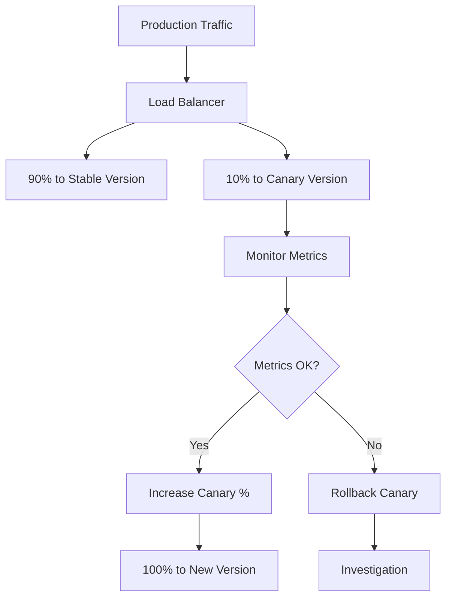
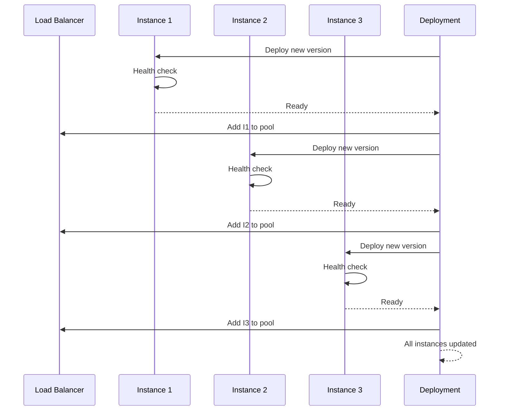
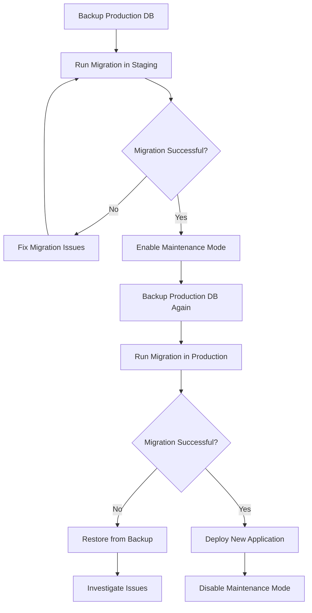

# Deployment View - Infrastructure and Operations

This document describes the deployment architecture, infrastructure components, and operational aspects of the Thesis Supervisor System.

## Overview

The deployment view shows how the system is deployed across different environments, the infrastructure components used, and the operational procedures for maintaining the system in production.

## Environment Strategy

### Environment Progression

```
Development → Testing → Staging → Production
     ↓           ↓        ↓          ↓
  Feature    Integration  UAT     Live Users
  Testing      Testing   Testing      
```

### Environment Specifications

| Environment | Purpose | Infrastructure | Database | Monitoring |
|-------------|---------|----------------|----------|------------|
| **Development** | Feature development | Local/Docker | SQLite | Basic logging |
| **Testing** | Automated testing | CI/CD runners | PostgreSQL | Test reports |
| **Staging** | Pre-production validation | AWS/Azure | Production mirror | Full monitoring |
| **Production** | Live system | AWS/Azure | High availability | Comprehensive |

## Infrastructure Architecture

### Production Infrastructure

```
                                Internet
                                    │
                                    ▼
                        ┌─────────────────────────┐
                        │      AWS CloudFront     │
                        │    (Global CDN + SSL)   │
                        └─────────────────────────┘
                                    │
                                    ▼
                        ┌─────────────────────────┐
                        │  Application Load       │
                        │  Balancer (ALB)         │
                        └─────────────────────────┘
                                    │
                    ┌───────────────┼───────────────┐
                    │               │               │
                    ▼               ▼               ▼
        ┌─────────────────┐ ┌─────────────────┐ ┌─────────────────┐
        │   ECS Cluster   │ │   ECS Cluster   │ │   ECS Cluster   │
        │   (AZ-1a)       │ │   (AZ-1b)       │ │   (AZ-1c)       │
        └─────────────────┘ └─────────────────┘ └─────────────────┘
                    │               │               │
                    └───────────────┼───────────────┘
                                    │
                        ┌─────────────────────────┐
                        │      Data Layer         │
                        │                         │
                        │  ┌─────────────────┐    │
                        │  │ RDS PostgreSQL  │    │
                        │  │ (Multi-AZ)      │    │
                        │  └─────────────────┘    │
                        │                         │
                        │  ┌─────────────────┐    │
                        │  │ ElastiCache     │    │
                        │  │ (Redis)         │    │
                        │  └─────────────────┘    │
                        │                         │
                        │  ┌─────────────────┐    │
                        │  │ S3 Buckets      │    │
                        │  │ (File Storage)  │    │
                        │  └─────────────────┘    │
                        └─────────────────────────┘
```

### Network Architecture

```
                        ┌─────────────────────────────────────────┐
                        │                 VPC                      │
                        │         10.0.0.0/16                     │
                        │                                         │
                        │  ┌─────────────────────────────────────┐ │
                        │  │          Public Subnets             │ │
                        │  │                                     │ │
                        │  │  ┌─────────────┐ ┌─────────────┐    │ │
                        │  │  │  ALB        │ │  NAT        │    │ │
                        │  │  │  (AZ-1a)    │ │  Gateway    │    │ │
                        │  │  └─────────────┘ │  (AZ-1a)    │    │ │
                        │  │                  └─────────────┘    │ │
                        │  └─────────────────────────────────────┘ │
                        │                                         │
                        │  ┌─────────────────────────────────────┐ │
                        │  │         Private Subnets              │ │
                        │  │                                     │ │
                        │  │  ┌─────────────┐ ┌─────────────┐    │ │
                        │  │  │ ECS Tasks   │ │ ECS Tasks   │    │ │
                        │  │  │ (AZ-1a)     │ │ (AZ-1b)     │    │ │
                        │  │  └─────────────┘ └─────────────┘    │ │
                        │  └─────────────────────────────────────┘ │
                        │                                         │
                        │  ┌─────────────────────────────────────┐ │
                        │  │        Database Subnets             │ │
                        │  │                                     │ │
                        │  │  ┌─────────────┐ ┌─────────────┐    │ │
                        │  │  │ RDS         │ │ RDS         │    │ │
                        │  │  │ Primary     │ │ Standby     │    │ │
                        │  │  │ (AZ-1a)     │ │ (AZ-1b)     │    │ │
                        │  │  └─────────────┘ └─────────────┘    │ │
                        │  └─────────────────────────────────────┘ │
                        └─────────────────────────────────────────┘
```

## Container Architecture

### ECS Service Configuration

```yaml
# ECS Task Definition
family: thesis-supervisor
networkMode: awsvpc
requiresCompatibilities:
  - FARGATE
cpu: 1024
memory: 2048
executionRoleArn: arn:aws:iam::ACCOUNT:role/ecsTaskExecutionRole
taskRoleArn: arn:aws:iam::ACCOUNT:role/ecsTaskRole

containerDefinitions:
  - name: thesis-supervisor-app
    image: your-account.dkr.ecr.us-east-1.amazonaws.com/thesis-supervisor:latest
    
    portMappings:
      - containerPort: 8000
        protocol: tcp
    
    environment:
      - name: NODE_ENV
        value: production
      - name: PORT
        value: "8000"
    
    secrets:
      - name: DATABASE_URL
        valueFrom: arn:aws:secretsmanager:us-east-1:ACCOUNT:secret:thesis-supervisor/database-url
      - name: JWT_SECRET_KEY
        valueFrom: arn:aws:secretsmanager:us-east-1:ACCOUNT:secret:thesis-supervisor/jwt-secret
      - name: TELEGRAM_BOT_TOKEN
        valueFrom: arn:aws:secretsmanager:us-east-1:ACCOUNT:secret:thesis-supervisor/telegram-token
    
    logConfiguration:
      logDriver: awslogs
      options:
        awslogs-group: /ecs/thesis-supervisor
        awslogs-region: us-east-1
        awslogs-stream-prefix: ecs
    
    healthCheck:
      command: ["CMD-SHELL", "curl -f http://localhost:8000/health || exit 1"]
      interval: 30
      timeout: 5
      retries: 3
      startPeriod: 60
```

### Multi-Container Setup

```yaml
# docker-compose.yml for local development
version: '3.8'

services:
  app:
    build: .
    ports:
      - "8000:8000"
    environment:
      - DATABASE_URL=postgresql://postgres:password@db:5432/thesis_db
      - REDIS_URL=redis://redis:6379
      - TELEGRAM_BOT_TOKEN=${TELEGRAM_BOT_TOKEN}
    depends_on:
      - db
      - redis
    networks:
      - app-network
    volumes:
      - ./app:/app
      - uploads:/app/uploads
    healthcheck:
      test: ["CMD", "curl", "-f", "http://localhost:8000/health"]
      interval: 30s
      timeout: 10s
      retries: 3

  db:
    image: postgres:13
    environment:
      - POSTGRES_DB=thesis_db
      - POSTGRES_USER=postgres
      - POSTGRES_PASSWORD=password
    volumes:
      - postgres_data:/var/lib/postgresql/data
      - ./init.sql:/docker-entrypoint-initdb.d/init.sql
    ports:
      - "5432:5432"
    networks:
      - app-network
    healthcheck:
      test: ["CMD-SHELL", "pg_isready -U postgres"]
      interval: 10s
      timeout: 5s
      retries: 5

  redis:
    image: redis:7-alpine
    ports:
      - "6379:6379"
    volumes:
      - redis_data:/data
    networks:
      - app-network
    healthcheck:
      test: ["CMD", "redis-cli", "ping"]
      interval: 10s
      timeout: 3s
      retries: 3

  nginx:
    image: nginx:alpine
    ports:
      - "80:80"
      - "443:443"
    volumes:
      - ./nginx.conf:/etc/nginx/nginx.conf
      - ./ssl:/etc/nginx/ssl
      - static_files:/var/www/static
    depends_on:
      - app
    networks:
      - app-network

volumes:
  postgres_data:
  redis_data:
  uploads:
  static_files:

networks:
  app-network:
    driver: bridge
```

## Deployment Strategies

### 1. Blue-Green Deployment

```mermaid
graph TD
    A[Current Production (Blue)] --> B[Load Balancer]
    C[New Version (Green)] --> D[Testing]
    D --> E{Tests Pass?}
    E -->|Yes| F[Switch Traffic to Green]
    E -->|No| G[Fix Issues]
    G --> D
    F --> H[Blue becomes standby]
    H --> I[Deployment Complete]
    
    subgraph "Blue Environment"
        A
        J[App v1.0]
        K[Database]
    end
    
    subgraph "Green Environment"
        C
        L[App v2.0]
        M[Database]
    end
```

#### Blue-Green Deployment Script

```bash
#!/bin/bash
# blue-green-deploy.sh

set -e

ENVIRONMENT=$1
NEW_VERSION=$2
CURRENT_COLOR=$(aws elbv2 describe-target-groups --names "thesis-supervisor-$ENVIRONMENT" --query 'TargetGroups[0].Tags[?Key==`Color`].Value' --output text)

# Determine target color
if [ "$CURRENT_COLOR" = "blue" ]; then
    TARGET_COLOR="green"
    STANDBY_COLOR="blue"
else
    TARGET_COLOR="blue"
    STANDBY_COLOR="green"
fi

echo "Deploying $NEW_VERSION to $TARGET_COLOR environment"

# Update ECS service with new task definition
aws ecs update-service \
    --cluster "thesis-supervisor-$ENVIRONMENT" \
    --service "thesis-supervisor-$TARGET_COLOR" \
    --task-definition "thesis-supervisor:$NEW_VERSION" \
    --desired-count 2

# Wait for deployment to complete
aws ecs wait services-stable \
    --cluster "thesis-supervisor-$ENVIRONMENT" \
    --services "thesis-supervisor-$TARGET_COLOR"

# Health check
HEALTH_CHECK_URL="http://thesis-supervisor-$TARGET_COLOR-$ENVIRONMENT.internal/health"
for i in {1..30}; do
    if curl -f "$HEALTH_CHECK_URL"; then
        echo "Health check passed"
        break
    fi
    echo "Health check failed, retrying in 10 seconds..."
    sleep 10
done

# Switch traffic
aws elbv2 modify-target-group \
    --target-group-arn "arn:aws:elasticloadbalancing:us-east-1:ACCOUNT:targetgroup/thesis-supervisor-$ENVIRONMENT" \
    --targets "Id=thesis-supervisor-$TARGET_COLOR-$ENVIRONMENT,Port=8000"

# Scale down old environment
aws ecs update-service \
    --cluster "thesis-supervisor-$ENVIRONMENT" \
    --service "thesis-supervisor-$STANDBY_COLOR" \
    --desired-count 0

echo "Blue-green deployment completed successfully"
```

### 2. Canary Deployment



#### Canary Deployment Configuration

```yaml
# Kubernetes Canary Deployment
apiVersion: argoproj.io/v1alpha1
kind: Rollout
metadata:
  name: thesis-supervisor-rollout
spec:
  replicas: 10
  strategy:
    canary:
      steps:
      - setWeight: 10
      - pause: {duration: 300s}
      - setWeight: 30
      - pause: {duration: 300s}
      - setWeight: 60
      - pause: {duration: 300s}
      - setWeight: 100
      
      analysis:
        templates:
        - templateName: error-rate-analysis
        args:
        - name: service-name
          value: thesis-supervisor
        
        successCondition: result[0] < 0.01
        failureLimit: 3
        
  selector:
    matchLabels:
      app: thesis-supervisor
      
  template:
    metadata:
      labels:
        app: thesis-supervisor
    spec:
      containers:
      - name: thesis-supervisor
        image: thesis-supervisor:latest
        ports:
        - containerPort: 8000
        livenessProbe:
          httpGet:
            path: /health
            port: 8000
          initialDelaySeconds: 30
          periodSeconds: 10
```

### 3. Rolling Deployment



## Database Deployment

### Database Migration Strategy



### Database Migration Script

```python
#!/usr/bin/env python3
# migrate.py

import os
import sys
import subprocess
import time
from datetime import datetime

def create_backup():
    """Create database backup before migration."""
    timestamp = datetime.now().strftime("%Y%m%d_%H%M%S")
    backup_file = f"backup_pre_migration_{timestamp}.sql"
    
    cmd = [
        "pg_dump",
        os.environ.get("DATABASE_URL"),
        "-f", backup_file,
        "--no-owner",
        "--no-privileges"
    ]
    
    result = subprocess.run(cmd, capture_output=True, text=True)
    if result.returncode != 0:
        print(f"Backup failed: {result.stderr}")
        return False
    
    print(f"Backup created: {backup_file}")
    return backup_file

def run_migration():
    """Run database migration."""
    from alembic import command
    from alembic.config import Config
    
    alembic_cfg = Config("alembic.ini")
    
    try:
        command.upgrade(alembic_cfg, "head")
        print("Migration completed successfully")
        return True
    except Exception as e:
        print(f"Migration failed: {e}")
        return False

def verify_migration():
    """Verify migration was successful."""
    from app.Infrastructure.DataBase.session import SessionLocal
    from app.Infrastructure.DataBase.Models.user import User
    
    try:
        with SessionLocal() as session:
            # Test basic queries
            user_count = session.query(User).count()
            print(f"Migration verification: {user_count} users in database")
            return True
    except Exception as e:
        print(f"Migration verification failed: {e}")
        return False

def main():
    if len(sys.argv) > 1 and sys.argv[1] == "--verify-only":
        return verify_migration()
    
    # Create backup
    backup_file = create_backup()
    if not backup_file:
        print("Backup failed, aborting migration")
        return False
    
    # Run migration
    if not run_migration():
        print("Migration failed, database backup available:", backup_file)
        return False
    
    # Verify migration
    if not verify_migration():
        print("Migration verification failed")
        return False
    
    print("Migration completed successfully")
    return True

if __name__ == "__main__":
    success = main()
    sys.exit(0 if success else 1)
```

## Security Configuration

### SSL/TLS Configuration

```nginx
# nginx SSL configuration
server {
    listen 80;
    server_name thesis-supervisor.com;
    return 301 https://$server_name$request_uri;
}

server {
    listen 443 ssl http2;
    server_name thesis-supervisor.com;
    
    # SSL configuration
    ssl_certificate /etc/ssl/certs/thesis-supervisor.crt;
    ssl_certificate_key /etc/ssl/private/thesis-supervisor.key;
    ssl_protocols TLSv1.2 TLSv1.3;
    ssl_ciphers ECDHE-RSA-AES128-GCM-SHA256:ECDHE-RSA-AES256-GCM-SHA384;
    ssl_prefer_server_ciphers off;
    
    # Security headers
    add_header Strict-Transport-Security "max-age=31536000; includeSubDomains" always;
    add_header X-Frame-Options DENY always;
    add_header X-Content-Type-Options nosniff always;
    add_header X-XSS-Protection "1; mode=block" always;
    add_header Referrer-Policy "strict-origin-when-cross-origin" always;
    add_header Content-Security-Policy "default-src 'self'; script-src 'self' 'unsafe-inline'; style-src 'self' 'unsafe-inline'; img-src 'self' data:; font-src 'self'" always;
    
    # Rate limiting
    limit_req_zone $binary_remote_addr zone=api:10m rate=10r/s;
    limit_req_zone $binary_remote_addr zone=login:10m rate=5r/m;
    
    location / {
        proxy_pass http://backend;
        proxy_set_header Host $host;
        proxy_set_header X-Real-IP $remote_addr;
        proxy_set_header X-Forwarded-For $proxy_add_x_forwarded_for;
        proxy_set_header X-Forwarded-Proto $scheme;
        
        # Rate limiting
        limit_req zone=api burst=20 nodelay;
    }
    
    location /api/auth/login {
        proxy_pass http://backend;
        limit_req zone=login burst=5 nodelay;
    }
}
```

### Infrastructure Security

```hcl
# Security Groups
resource "aws_security_group" "alb_sg" {
  name_prefix = "thesis-supervisor-alb-"
  vpc_id      = aws_vpc.main.id

  ingress {
    from_port   = 80
    to_port     = 80
    protocol    = "tcp"
    cidr_blocks = ["0.0.0.0/0"]
  }

  ingress {
    from_port   = 443
    to_port     = 443
    protocol    = "tcp"
    cidr_blocks = ["0.0.0.0/0"]
  }

  egress {
    from_port   = 0
    to_port     = 0
    protocol    = "-1"
    cidr_blocks = ["0.0.0.0/0"]
  }
}

resource "aws_security_group" "app_sg" {
  name_prefix = "thesis-supervisor-app-"
  vpc_id      = aws_vpc.main.id

  ingress {
    from_port       = 8000
    to_port         = 8000
    protocol        = "tcp"
    security_groups = [aws_security_group.alb_sg.id]
  }

  egress {
    from_port   = 0
    to_port     = 0
    protocol    = "-1"
    cidr_blocks = ["0.0.0.0/0"]
  }
}

resource "aws_security_group" "db_sg" {
  name_prefix = "thesis-supervisor-db-"
  vpc_id      = aws_vpc.main.id

  ingress {
    from_port       = 5432
    to_port         = 5432
    protocol        = "tcp"
    security_groups = [aws_security_group.app_sg.id]
  }
}
```

## Monitoring and Observability

### CloudWatch Monitoring

```json
{
  "widgets": [
    {
      "type": "metric",
      "properties": {
        "metrics": [
          ["AWS/ECS", "CPUUtilization", "ServiceName", "thesis-supervisor-service"],
          ["AWS/ECS", "MemoryUtilization", "ServiceName", "thesis-supervisor-service"]
        ],
        "period": 300,
        "stat": "Average",
        "region": "us-east-1",
        "title": "ECS Resource Utilization"
      }
    },
    {
      "type": "metric",
      "properties": {
        "metrics": [
          ["AWS/ApplicationELB", "RequestCount", "LoadBalancer", "thesis-supervisor-alb"],
          ["AWS/ApplicationELB", "HTTPCode_Target_2XX_Count", "LoadBalancer", "thesis-supervisor-alb"],
          ["AWS/ApplicationELB", "HTTPCode_Target_4XX_Count", "LoadBalancer", "thesis-supervisor-alb"],
          ["AWS/ApplicationELB", "HTTPCode_Target_5XX_Count", "LoadBalancer", "thesis-supervisor-alb"]
        ],
        "period": 300,
        "stat": "Sum",
        "region": "us-east-1",
        "title": "Application Load Balancer Metrics"
      }
    },
    {
      "type": "metric",
      "properties": {
        "metrics": [
          ["AWS/RDS", "CPUUtilization", "DBInstanceIdentifier", "thesis-supervisor-db"],
          ["AWS/RDS", "DatabaseConnections", "DBInstanceIdentifier", "thesis-supervisor-db"],
          ["AWS/RDS", "ReadLatency", "DBInstanceIdentifier", "thesis-supervisor-db"],
          ["AWS/RDS", "WriteLatency", "DBInstanceIdentifier", "thesis-supervisor-db"]
        ],
        "period": 300,
        "stat": "Average",
        "region": "us-east-1",
        "title": "RDS Database Metrics"
      }
    }
  ]
}
```

### Application Metrics

```python
# app/monitoring/metrics.py
from prometheus_client import Counter, Histogram, Gauge, start_http_server
import time

# Business metrics
THESIS_SUBMISSIONS = Counter('thesis_submissions_total', 'Total thesis submissions')
USER_REGISTRATIONS = Counter('user_registrations_total', 'Total user registrations')
REVIEW_COMPLETIONS = Counter('review_completions_total', 'Total review completions')

# System metrics
REQUEST_DURATION = Histogram('http_request_duration_seconds', 'HTTP request duration')
ACTIVE_CONNECTIONS = Gauge('database_connections_active', 'Active database connections')
MEMORY_USAGE = Gauge('memory_usage_bytes', 'Memory usage in bytes')

# Error tracking
ERROR_RATE = Counter('application_errors_total', 'Total application errors', ['error_type'])

class MetricsMiddleware:
    def __init__(self, app):
        self.app = app
    
    async def __call__(self, scope, receive, send):
        if scope["type"] == "http":
            start_time = time.time()
            
            try:
                await self.app(scope, receive, send)
            except Exception as e:
                ERROR_RATE.labels(error_type=type(e).__name__).inc()
                raise
            finally:
                REQUEST_DURATION.observe(time.time() - start_time)
        else:
            await self.app(scope, receive, send)

# Start metrics server
start_http_server(8001)
```

### Logging Configuration

```python
# app/logging_config.py
import logging
import sys
from pythonjsonlogger import jsonlogger

def setup_logging():
    # Create logger
    logger = logging.getLogger()
    logger.setLevel(logging.INFO)
    
    # Create console handler
    handler = logging.StreamHandler(sys.stdout)
    handler.setLevel(logging.INFO)
    
    # Create JSON formatter
    formatter = jsonlogger.JsonFormatter(
        '%(asctime)s %(name)s %(levelname)s %(message)s'
    )
    handler.setFormatter(formatter)
    
    # Add handler to logger
    logger.addHandler(handler)
    
    return logger

# Application logging
class StructuredLogger:
    def __init__(self, name):
        self.logger = logging.getLogger(name)
    
    def info(self, message, **kwargs):
        self.logger.info(message, extra=kwargs)
    
    def error(self, message, **kwargs):
        self.logger.error(message, extra=kwargs)
    
    def warning(self, message, **kwargs):
        self.logger.warning(message, extra=kwargs)

# Usage
logger = StructuredLogger(__name__)
logger.info("User registered", user_id="123", email="user@example.com")
```

## Backup and Recovery

### Backup Strategy

```bash
#!/bin/bash
# backup.sh

set -e

ENVIRONMENT=$1
BACKUP_TYPE=${2:-"full"}
TIMESTAMP=$(date +%Y%m%d_%H%M%S)

echo "Starting $BACKUP_TYPE backup for $ENVIRONMENT environment"

# Database backup
DB_BACKUP_FILE="db_backup_${ENVIRONMENT}_${TIMESTAMP}.sql"
pg_dump $DATABASE_URL > $DB_BACKUP_FILE
gzip $DB_BACKUP_FILE

# Upload to S3
aws s3 cp ${DB_BACKUP_FILE}.gz s3://thesis-supervisor-backups/${ENVIRONMENT}/database/

# File storage backup
aws s3 sync s3://thesis-supervisor-files-${ENVIRONMENT} s3://thesis-supervisor-backups/${ENVIRONMENT}/files/

# Configuration backup
kubectl get configmaps -o yaml > config_backup_${ENVIRONMENT}_${TIMESTAMP}.yaml
kubectl get secrets -o yaml > secrets_backup_${ENVIRONMENT}_${TIMESTAMP}.yaml

echo "Backup completed successfully"
```

### Recovery Procedures

```bash
#!/bin/bash
# recover.sh

set -e

ENVIRONMENT=$1
BACKUP_DATE=$2

echo "Starting recovery for $ENVIRONMENT environment from backup $BACKUP_DATE"

# Stop application
kubectl scale deployment thesis-supervisor --replicas=0

# Restore database
DB_BACKUP_FILE="db_backup_${ENVIRONMENT}_${BACKUP_DATE}.sql.gz"
aws s3 cp s3://thesis-supervisor-backups/${ENVIRONMENT}/database/${DB_BACKUP_FILE} .
gunzip $DB_BACKUP_FILE
psql $DATABASE_URL < ${DB_BACKUP_FILE%.gz}

# Restore files
aws s3 sync s3://thesis-supervisor-backups/${ENVIRONMENT}/files/ s3://thesis-supervisor-files-${ENVIRONMENT}/

# Restore configuration
kubectl apply -f config_backup_${ENVIRONMENT}_${BACKUP_DATE}.yaml
kubectl apply -f secrets_backup_${ENVIRONMENT}_${BACKUP_DATE}.yaml

# Start application
kubectl scale deployment thesis-supervisor --replicas=3

echo "Recovery completed successfully"
```

## Auto-scaling Configuration

### ECS Auto Scaling

```json
{
  "ServiceName": "thesis-supervisor-service",
  "ScalableDimension": "ecs:service:DesiredCount",
  "MinCapacity": 2,
  "MaxCapacity": 10,
  "TargetTrackingScalingPolicy": {
    "TargetValue": 70.0,
    "PredefinedMetricSpecification": {
      "PredefinedMetricType": "ECSServiceAverageCPUUtilization"
    },
    "ScaleOutCooldown": 300,
    "ScaleInCooldown": 300
  }
}
```

### Database Auto Scaling

```hcl
resource "aws_appautoscaling_target" "rds_target" {
  max_capacity       = 16
  min_capacity       = 2
  resource_id        = "cluster:thesis-supervisor-aurora-cluster"
  scalable_dimension = "rds:cluster:ReadReplicaCount"
  service_namespace  = "rds"
}

resource "aws_appautoscaling_policy" "rds_policy" {
  name               = "thesis-supervisor-rds-policy"
  policy_type        = "TargetTrackingScaling"
  resource_id        = aws_appautoscaling_target.rds_target.resource_id
  scalable_dimension = aws_appautoscaling_target.rds_target.scalable_dimension
  service_namespace  = aws_appautoscaling_target.rds_target.service_namespace

  target_tracking_scaling_policy_configuration {
    predefined_metric_specification {
      predefined_metric_type = "RDSReaderAverageCPUUtilization"
    }
    target_value = 70.0
  }
}
```

## Performance Optimization

### CDN Configuration

```hcl
resource "aws_cloudfront_distribution" "thesis_supervisor_cdn" {
  origin {
    domain_name = aws_lb.thesis_supervisor_alb.dns_name
    origin_id   = "thesis-supervisor-origin"

    custom_origin_config {
      http_port              = 80
      https_port             = 443
      origin_protocol_policy = "https-only"
      origin_ssl_protocols   = ["TLSv1.2"]
    }
  }

  enabled             = true
  is_ipv6_enabled     = true
  default_root_object = "index.html"

  default_cache_behavior {
    allowed_methods        = ["DELETE", "GET", "HEAD", "OPTIONS", "PATCH", "POST", "PUT"]
    cached_methods         = ["GET", "HEAD"]
    target_origin_id       = "thesis-supervisor-origin"
    compress               = true
    viewer_protocol_policy = "redirect-to-https"

    forwarded_values {
      query_string = false
      headers      = ["Host", "Authorization"]
      cookies {
        forward = "none"
      }
    }

    min_ttl     = 0
    default_ttl = 3600
    max_ttl     = 86400
  }

  # Cache behavior for static assets
  ordered_cache_behavior {
    path_pattern     = "/static/*"
    allowed_methods  = ["GET", "HEAD", "OPTIONS"]
    cached_methods   = ["GET", "HEAD"]
    target_origin_id = "thesis-supervisor-origin"
    compress         = true

    forwarded_values {
      query_string = false
      cookies {
        forward = "none"
      }
    }

    min_ttl     = 0
    default_ttl = 86400
    max_ttl     = 31536000
    viewer_protocol_policy = "redirect-to-https"
  }

  restrictions {
    geo_restriction {
      restriction_type = "none"
    }
  }

  viewer_certificate {
    cloudfront_default_certificate = true
  }
}
```

## Disaster Recovery

### Multi-Region Setup

```mermaid
graph TB
    subgraph "Primary Region (us-east-1)"
        A[Application] --> B[RDS Primary]
        A --> C[ElastiCache]
        A --> D[S3 Bucket]
    end
    
    subgraph "Secondary Region (us-west-2)"
        E[Application (Standby)] --> F[RDS Read Replica]
        E --> G[ElastiCache (Standby)]
        E --> H[S3 Bucket (Replicated)]
    end
    
    B --> F
    D --> H
    
    I[Route 53] --> A
    I -.-> E
```

### Failover Procedures

```bash
#!/bin/bash
# failover.sh

set -e

echo "Starting failover to secondary region"

# Promote read replica to primary
aws rds promote-read-replica \
    --db-instance-identifier thesis-supervisor-replica-west \
    --region us-west-2

# Update DNS to point to secondary region
aws route53 change-resource-record-sets \
    --hosted-zone-id Z1234567890ABC \
    --change-batch '{
        "Changes": [{
            "Action": "UPSERT",
            "ResourceRecordSet": {
                "Name": "thesis-supervisor.com",
                "Type": "A",
                "AliasTarget": {
                    "DNSName": "thesis-supervisor-alb-west.us-west-2.elb.amazonaws.com",
                    "EvaluateTargetHealth": true,
                    "HostedZoneId": "Z215JYRZR1TBD5"
                }
            }
        }]
    }'

# Scale up secondary region
aws ecs update-service \
    --cluster thesis-supervisor-west \
    --service thesis-supervisor-service \
    --desired-count 3 \
    --region us-west-2

echo "Failover completed"
```

## Conclusion

The deployment view of the Thesis Supervisor System provides:

1. **Scalable Infrastructure**: Auto-scaling capabilities for handling varying loads
2. **High Availability**: Multi-AZ deployment with redundancy
3. **Security**: Comprehensive security measures at all layers
4. **Monitoring**: Complete observability and alerting
5. **Disaster Recovery**: Backup and recovery procedures
6. **Performance**: CDN and caching for optimal user experience
7. **Deployment Automation**: Blue-green and canary deployment strategies

This deployment architecture ensures the system can handle production workloads while maintaining high availability, security, and performance standards. 