# Dynamic View - System Behavior

This document describes the dynamic behavior of the Thesis Supervisor System, including workflows, interactions, and runtime behavior patterns.

## Overview

The dynamic view focuses on how the system components interact at runtime to accomplish specific tasks. It shows the temporal aspects of the system behavior through sequence diagrams, activity flows, and state transitions.

## Key User Scenarios

### 1. User Registration and Onboarding

#### Registration Flow
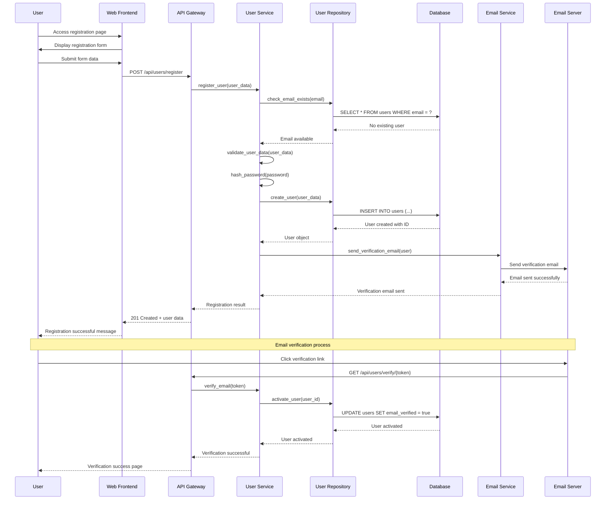
```mermaid
sequenceDiagram
    participant U as User
    participant W as Web Frontend
    participant API as API Gateway
    participant US as User Service
    participant UR as User Repository
    participant DB as Database
    participant ES as Email Service
    participant SMTP as Email Server

    U->>W: Access registration page
    W->>U: Display registration form
    U->>W: Submit form data
    W->>API: POST /api/users/register
    
    API->>US: register_user(user_data)
    US->>UR: check_email_exists(email)
    UR->>DB: SELECT * FROM users WHERE email = ?
    DB-->>UR: No existing user
    UR-->>US: Email available
    
    US->>US: validate_user_data(user_data)
    US->>US: hash_password(password)
    US->>UR: create_user(user_data)
    UR->>DB: INSERT INTO users (...)
    DB-->>UR: User created with ID
    UR-->>US: User object
    
    US->>ES: send_verification_email(user)
    ES->>SMTP: Send verification email
    SMTP-->>ES: Email sent successfully
    ES-->>US: Verification email sent
    
    US-->>API: Registration result
    API-->>W: 201 Created + user data
    W-->>U: Registration successful message
    
    Note over U,SMTP: Email verification process
    U->>SMTP: Click verification link
    SMTP->>API: GET /api/users/verify/{token}
    API->>US: verify_email(token)
    US->>UR: activate_user(user_id)
    UR->>DB: UPDATE users SET email_verified = true
    DB-->>UR: User activated
    UR-->>US: User activated
    US-->>API: Verification successful
    API-->>U: Verification success page
```

#### Registration Activity Flow
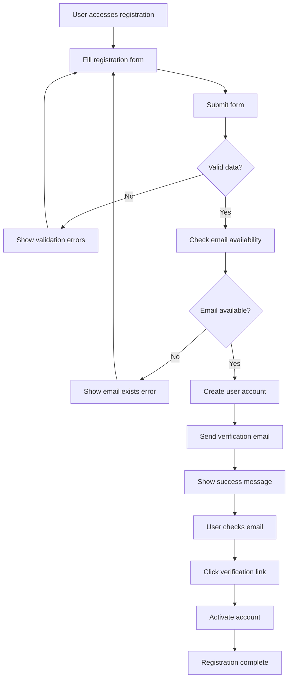
```mermaid
flowchart TD
    A[User accesses registration] --> B[Fill registration form]
    B --> C[Submit form]
    C --> D{Valid data?}
    D -->|No| E[Show validation errors]
    E --> B
    D -->|Yes| F[Check email availability]
    F --> G{Email available?}
    G -->|No| H[Show email exists error]
    H --> B
    G -->|Yes| I[Create user account]
    I --> J[Send verification email]
    J --> K[Show success message]
    K --> L[User checks email]
    L --> M[Click verification link]
    M --> N[Activate account]
    N --> O[Registration complete]
```

### 2. Authentication and Authorization

#### Login Flow
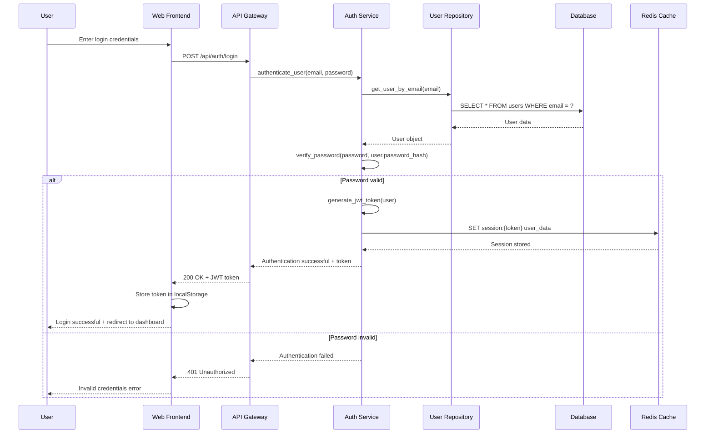
```mermaid
sequenceDiagram
    participant U as User
    participant W as Web Frontend
    participant API as API Gateway
    participant AS as Auth Service
    participant UR as User Repository
    participant DB as Database
    participant Cache as Redis Cache

    U->>W: Enter login credentials
    W->>API: POST /api/auth/login
    API->>AS: authenticate_user(email, password)
    
    AS->>UR: get_user_by_email(email)
    UR->>DB: SELECT * FROM users WHERE email = ?
    DB-->>UR: User data
    UR-->>AS: User object
    
    AS->>AS: verify_password(password, user.password_hash)
    alt Password valid
        AS->>AS: generate_jwt_token(user)
        AS->>Cache: SET session:{token} user_data
        Cache-->>AS: Session stored
        AS-->>API: Authentication successful + token
        API-->>W: 200 OK + JWT token
        W->>W: Store token in localStorage
        W-->>U: Login successful + redirect to dashboard
    else Password invalid
        AS-->>API: Authentication failed
        API-->>W: 401 Unauthorized
        W-->>U: Invalid credentials error
    end
```

#### Session Management
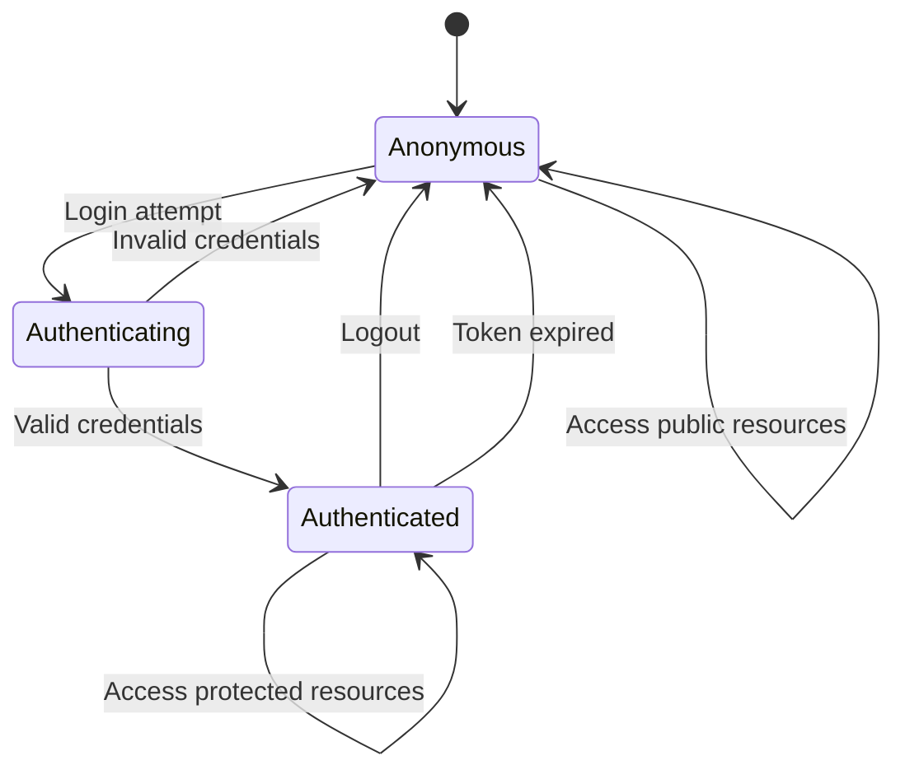
```mermaid
stateDiagram-v2
    [*] --> Anonymous
    Anonymous --> Authenticating : Login attempt
    Authenticating --> Authenticated : Valid credentials
    Authenticating --> Anonymous : Invalid credentials
    Authenticated --> Anonymous : Logout
    Authenticated --> Authenticated : Token refresh
    Authenticated --> Anonymous : Token expired
    Anonymous --> Anonymous : Access public resources
    Authenticated --> Authenticated : Access protected resources
```

### 3. Thesis Submission Workflow

#### Submission Process
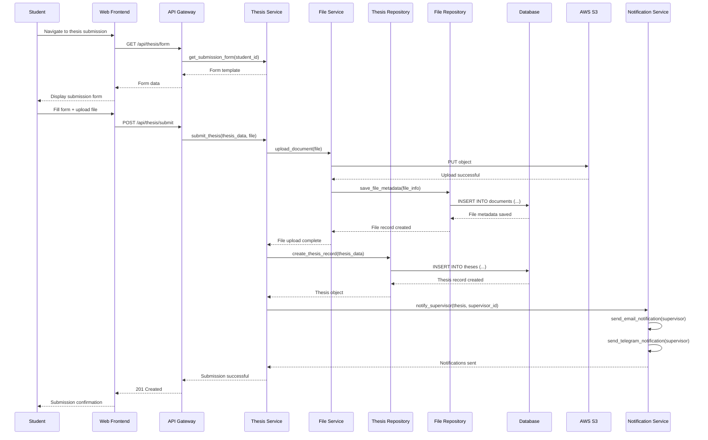
```mermaid
sequenceDiagram
    participant S as Student
    participant W as Web Frontend
    participant API as API Gateway
    participant TS as Thesis Service
    participant FS as File Service
    participant TR as Thesis Repository
    participant FR as File Repository
    participant DB as Database
    participant S3 as AWS S3
    participant NS as Notification Service

    S->>W: Navigate to thesis submission
    W->>API: GET /api/thesis/form
    API->>TS: get_submission_form(student_id)
    TS-->>API: Form template
    API-->>W: Form data
    W-->>S: Display submission form

    S->>W: Fill form + upload file
    W->>API: POST /api/thesis/submit
    API->>TS: submit_thesis(thesis_data, file)
    
    TS->>FS: upload_document(file)
    FS->>S3: PUT object
    S3-->>FS: Upload successful
    FS->>FR: save_file_metadata(file_info)
    FR->>DB: INSERT INTO documents (...)
    DB-->>FR: File metadata saved
    FR-->>FS: File record created
    FS-->>TS: File upload complete

    TS->>TR: create_thesis_record(thesis_data)
    TR->>DB: INSERT INTO theses (...)
    DB-->>TR: Thesis record created
    TR-->>TS: Thesis object

    TS->>NS: notify_supervisor(thesis, supervisor_id)
    NS->>NS: send_email_notification(supervisor)
    NS->>NS: send_telegram_notification(supervisor)
    NS-->>TS: Notifications sent

    TS-->>API: Submission successful
    API-->>W: 201 Created
    W-->>S: Submission confirmation
```

#### Thesis Lifecycle
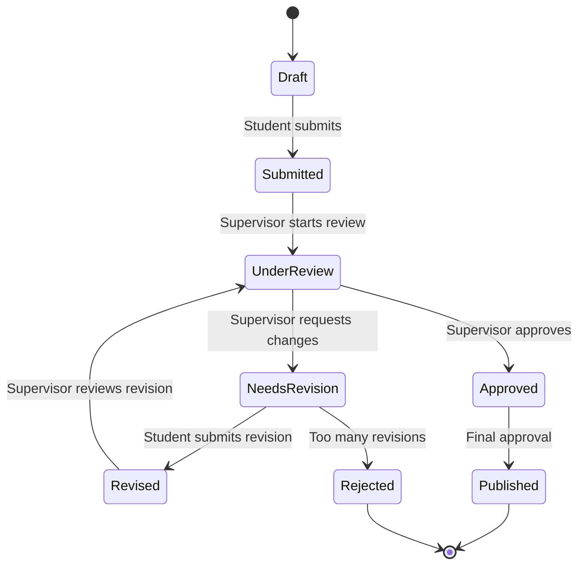
```mermaid
stateDiagram-v2
    [*] --> Draft
    Draft --> Submitted : Student submits
    Submitted --> UnderReview : Supervisor starts review
    UnderReview --> NeedsRevision : Supervisor requests changes
    UnderReview --> Approved : Supervisor approves
    NeedsRevision --> Revised : Student submits revision
    Revised --> UnderReview : Supervisor reviews revision
    Approved --> Published : Final approval
    Published --> [*]
    
    NeedsRevision --> Rejected : Too many revisions
    Rejected --> [*]
```

### 4. Supervisor Review Process

#### Review Workflow
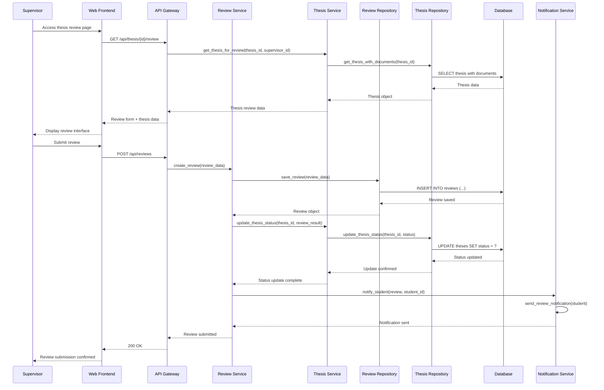
```mermaid
sequenceDiagram
    participant Sup as Supervisor
    participant W as Web Frontend
    participant API as API Gateway
    participant RS as Review Service
    participant TS as Thesis Service
    participant RR as Review Repository
    participant TR as Thesis Repository
    participant DB as Database
    participant NS as Notification Service

    Sup->>W: Access thesis review page
    W->>API: GET /api/thesis/{id}/review
    API->>TS: get_thesis_for_review(thesis_id, supervisor_id)
    TS->>TR: get_thesis_with_documents(thesis_id)
    TR->>DB: SELECT thesis with documents
    DB-->>TR: Thesis data
    TR-->>TS: Thesis object
    TS-->>API: Thesis review data
    API-->>W: Review form + thesis data
    W-->>Sup: Display review interface

    Sup->>W: Submit review
    W->>API: POST /api/reviews
    API->>RS: create_review(review_data)
    
    RS->>RR: save_review(review_data)
    RR->>DB: INSERT INTO reviews (...)
    DB-->>RR: Review saved
    RR-->>RS: Review object

    RS->>TS: update_thesis_status(thesis_id, review_result)
    TS->>TR: update_thesis_status(thesis_id, status)
    TR->>DB: UPDATE theses SET status = ?
    DB-->>TR: Status updated
    TR-->>TS: Update confirmed
    TS-->>RS: Status update complete

    RS->>NS: notify_student(review, student_id)
    NS->>NS: send_review_notification(student)
    NS-->>RS: Notification sent

    RS-->>API: Review submitted
    API-->>W: 200 OK
    W-->>Sup: Review submission confirmed
```

#### Review Decision Process
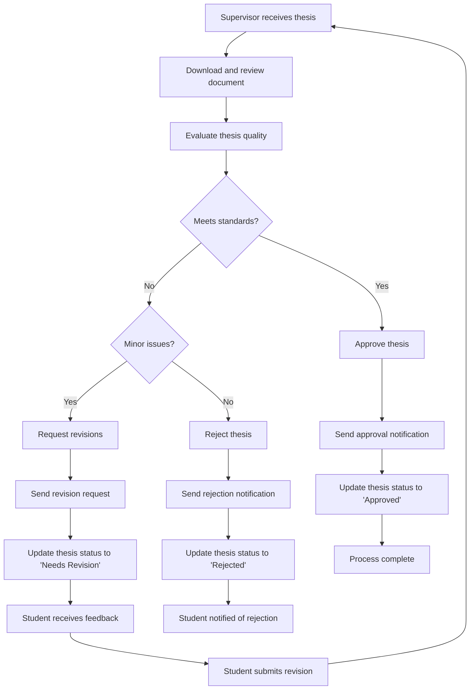
```mermaid
flowchart TD
    A[Supervisor receives thesis] --> B[Download and review document]
    B --> C[Evaluate thesis quality]
    C --> D{Meets standards?}
    D -->|Yes| E[Approve thesis]
    D -->|No| F{Minor issues?}
    F -->|Yes| G[Request revisions]
    F -->|No| H[Reject thesis]
    E --> I[Send approval notification]
    G --> J[Send revision request]
    H --> K[Send rejection notification]
    I --> L[Update thesis status to 'Approved']
    J --> M[Update thesis status to 'Needs Revision']
    K --> N[Update thesis status to 'Rejected']
    L --> O[Process complete]
    M --> P[Student receives feedback]
    N --> Q[Student notified of rejection]
    P --> R[Student submits revision]
    R --> A
```

### 5. Notification System

#### Multi-Channel Notification Flow
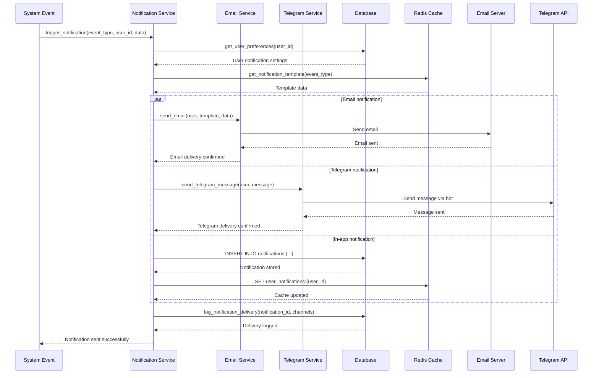
```mermaid
sequenceDiagram
    participant Sys as System Event
    participant NS as Notification Service
    participant ES as Email Service
    participant TS as Telegram Service
    participant DB as Database
    participant Cache as Redis Cache
    participant SMTP as Email Server
    participant TG as Telegram API

    Sys->>NS: trigger_notification(event_type, user_id, data)
    NS->>DB: get_user_preferences(user_id)
    DB-->>NS: User notification settings
    
    NS->>Cache: get_notification_template(event_type)
    Cache-->>NS: Template data
    
    par Email notification
        NS->>ES: send_email(user, template, data)
        ES->>SMTP: Send email
        SMTP-->>ES: Email sent
        ES-->>NS: Email delivery confirmed
    and Telegram notification
        NS->>TS: send_telegram_message(user, message)
        TS->>TG: Send message via bot
        TG-->>TS: Message sent
        TS-->>NS: Telegram delivery confirmed
    and In-app notification
        NS->>DB: INSERT INTO notifications (...)
        DB-->>NS: Notification stored
        NS->>Cache: SET user_notifications:{user_id}
        Cache-->>NS: Cache updated
    end
    
    NS->>DB: log_notification_delivery(notification_id, channels)
    DB-->>NS: Delivery logged
    NS-->>Sys: Notification sent successfully
```

### 6. Telegram Bot Interactions

#### Bot Command Processing
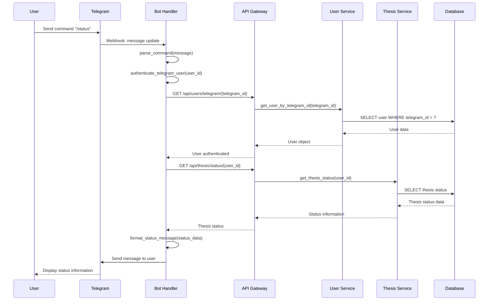
```mermaid
sequenceDiagram
    participant U as User
    participant TG as Telegram
    participant Bot as Bot Handler
    participant API as API Gateway
    participant US as User Service
    participant TS as Thesis Service
    participant DB as Database

    U->>TG: Send command "/status"
    TG->>Bot: Webhook: message update
    Bot->>Bot: parse_command(message)
    Bot->>Bot: authenticate_telegram_user(user_id)
    
    Bot->>API: GET /api/users/telegram/{telegram_id}
    API->>US: get_user_by_telegram_id(telegram_id)
    US->>DB: SELECT user WHERE telegram_id = ?
    DB-->>US: User data
    US-->>API: User object
    API-->>Bot: User authenticated
    
    Bot->>API: GET /api/thesis/status/{user_id}
    API->>TS: get_thesis_status(user_id)
    TS->>DB: SELECT thesis status
    DB-->>TS: Thesis status data
    TS-->>API: Status information
    API-->>Bot: Thesis status
    
    Bot->>Bot: format_status_message(status_data)
    Bot->>TG: Send message to user
    TG-->>U: Display status information
```

#### Bot State Management
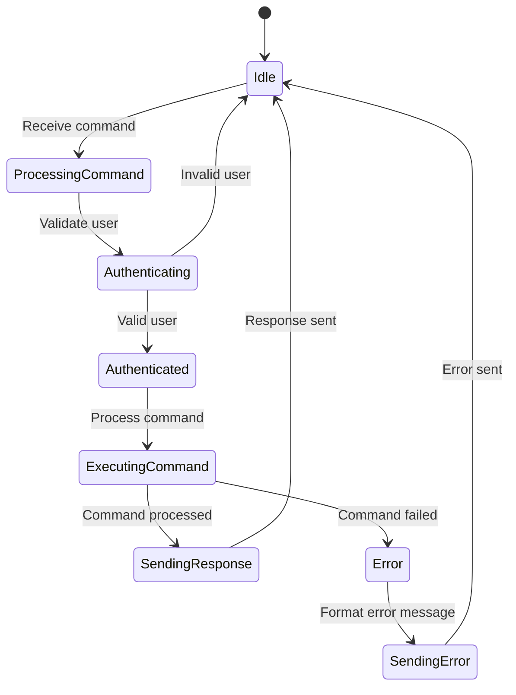
```mermaid
stateDiagram-v2
    [*] --> Idle
    Idle --> ProcessingCommand : Receive command
    ProcessingCommand --> Authenticating : Validate user
    Authenticating --> Authenticated : Valid user
    Authenticating --> Idle : Invalid user
    Authenticated --> ExecutingCommand : Process command
    ExecutingCommand --> SendingResponse : Command processed
    SendingResponse --> Idle : Response sent
    ExecutingCommand --> Error : Command failed
    Error --> SendingError : Format error message
    SendingError --> Idle : Error sent
```

### 7. File Upload and Management

#### Document Upload Flow
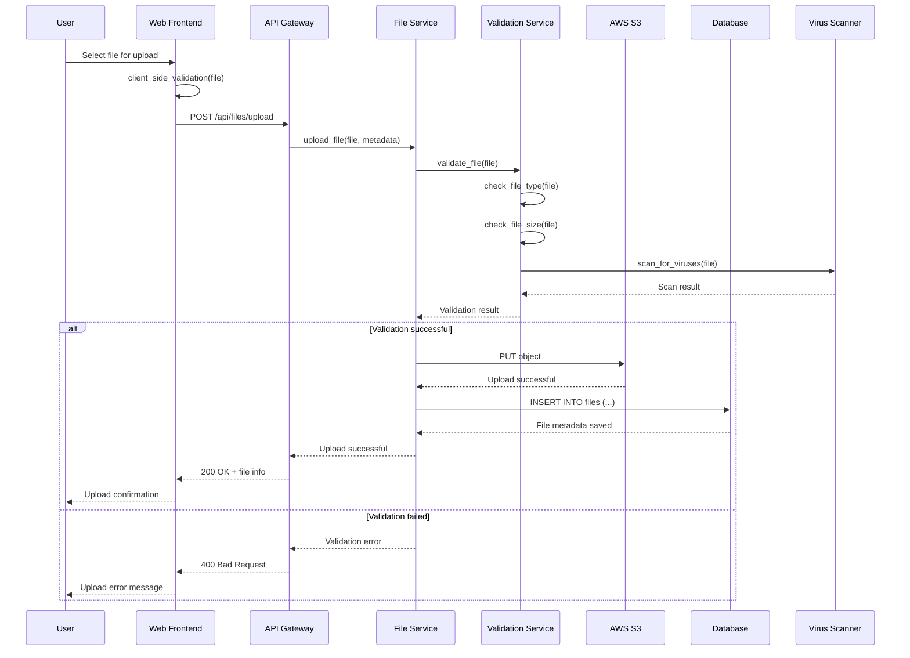
```mermaid
sequenceDiagram
    participant U as User
    participant W as Web Frontend
    participant API as API Gateway
    participant FS as File Service
    participant VS as Validation Service
    participant S3 as AWS S3
    participant DB as Database
    participant Scanner as Virus Scanner

    U->>W: Select file for upload
    W->>W: client_side_validation(file)
    W->>API: POST /api/files/upload
    
    API->>FS: upload_file(file, metadata)
    FS->>VS: validate_file(file)
    VS->>VS: check_file_type(file)
    VS->>VS: check_file_size(file)
    VS->>Scanner: scan_for_viruses(file)
    Scanner-->>VS: Scan result
    VS-->>FS: Validation result
    
    alt Validation successful
        FS->>S3: PUT object
        S3-->>FS: Upload successful
        FS->>DB: INSERT INTO files (...)
        DB-->>FS: File metadata saved
        FS-->>API: Upload successful
        API-->>W: 200 OK + file info
        W-->>U: Upload confirmation
    else Validation failed
        FS-->>API: Validation error
        API-->>W: 400 Bad Request
        W-->>U: Upload error message
    end
```

### 8. Performance and Caching

#### Cache Management Strategy
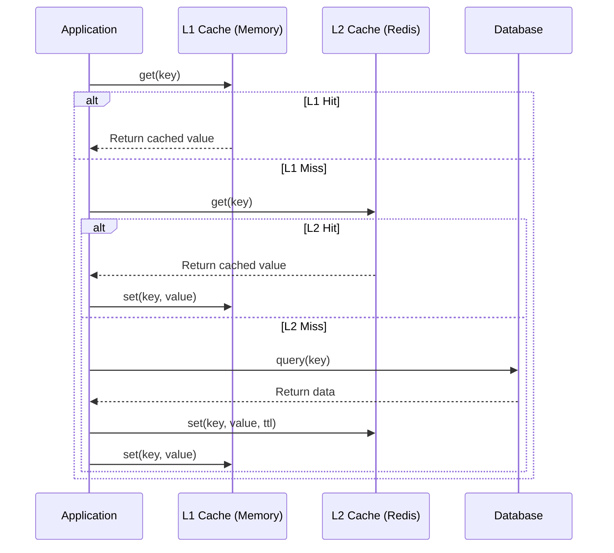
```mermaid
sequenceDiagram
    participant App as Application
    participant L1 as L1 Cache (Memory)
    participant L2 as L2 Cache (Redis)
    participant DB as Database

    App->>L1: get(key)
    alt L1 Hit
        L1-->>App: Return cached value
    else L1 Miss
        App->>L2: get(key)
        alt L2 Hit
            L2-->>App: Return cached value
            App->>L1: set(key, value)
        else L2 Miss
            App->>DB: query(key)
            DB-->>App: Return data
            App->>L2: set(key, value, ttl)
            App->>L1: set(key, value)
        end
    end
```

### 9. Error Handling and Recovery

#### Error Processing Flow
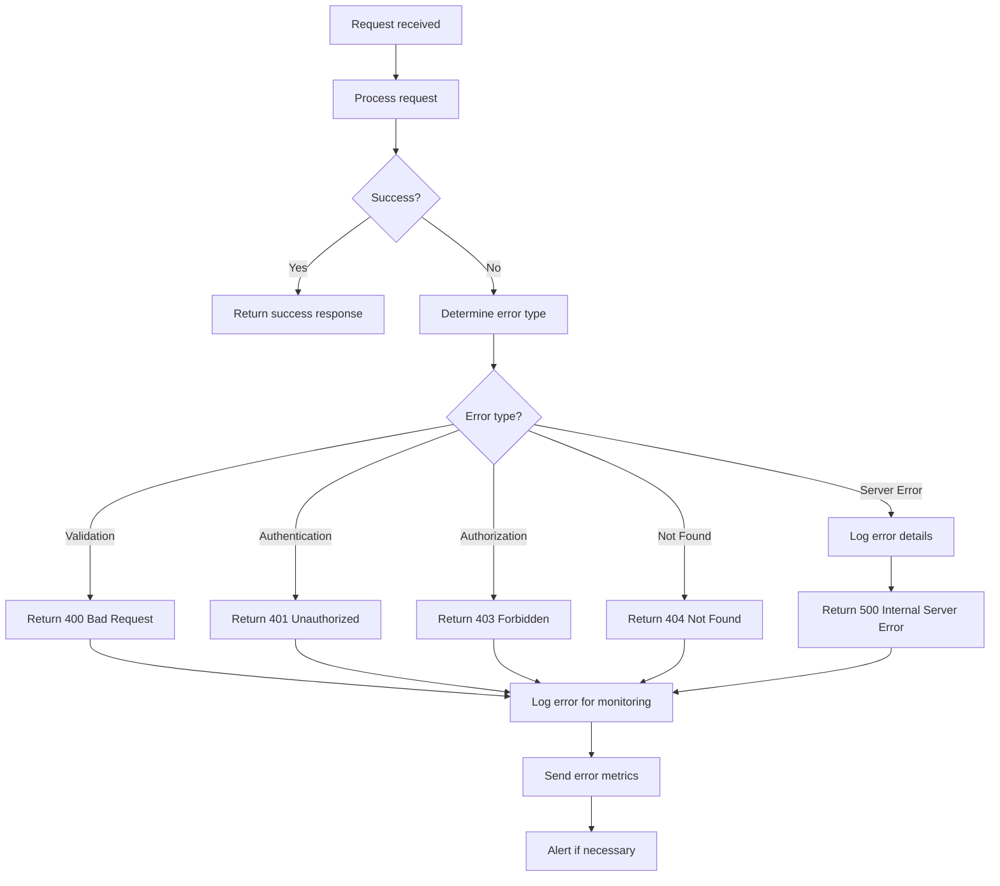
```mermaid
flowchart TD
    A[Request received] --> B[Process request]
    B --> C{Success?}
    C -->|Yes| D[Return success response]
    C -->|No| E[Determine error type]
    E --> F{Error type?}
    F -->|Validation| G[Return 400 Bad Request]
    F -->|Authentication| H[Return 401 Unauthorized]
    F -->|Authorization| I[Return 403 Forbidden]
    F -->|Not Found| J[Return 404 Not Found]
    F -->|Server Error| K[Log error details]
    K --> L[Return 500 Internal Server Error]
    G --> M[Log error for monitoring]
    H --> M
    I --> M
    J --> M
    L --> M
    M --> N[Send error metrics]
    N --> O[Alert if necessary]
```

### 10. Data Synchronization

#### User Data Sync Between Services
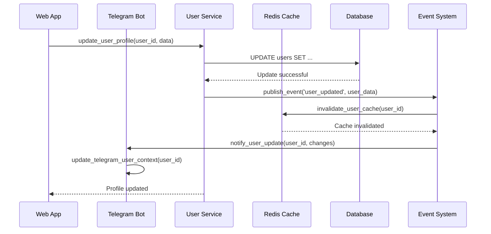
```mermaid
sequenceDiagram
    participant W as Web App
    participant T as Telegram Bot
    participant US as User Service
    participant Cache as Redis Cache
    participant DB as Database
    participant ES as Event System

    W->>US: update_user_profile(user_id, data)
    US->>DB: UPDATE users SET ...
    DB-->>US: Update successful
    US->>ES: publish_event('user_updated', user_data)
    ES->>Cache: invalidate_user_cache(user_id)
    Cache-->>ES: Cache invalidated
    ES->>T: notify_user_update(user_id, changes)
    T->>T: update_telegram_user_context(user_id)
    US-->>W: Profile updated
```

## Performance Patterns

### 1. Asynchronous Processing

#### Background Task Processing
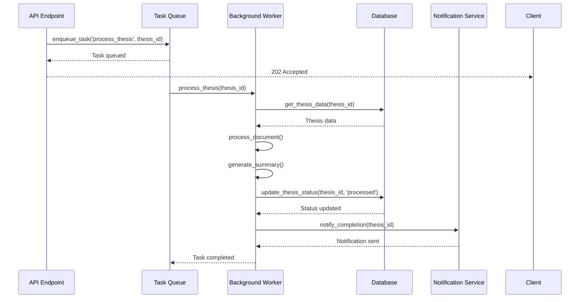
```mermaid
sequenceDiagram
    participant API as API Endpoint
    participant TQ as Task Queue
    participant Worker as Background Worker
    participant DB as Database
    participant NS as Notification Service

    API->>TQ: enqueue_task('process_thesis', thesis_id)
    TQ-->>API: Task queued
    API-->>Client: 202 Accepted
    
    TQ->>Worker: process_thesis(thesis_id)
    Worker->>DB: get_thesis_data(thesis_id)
    DB-->>Worker: Thesis data
    Worker->>Worker: process_document()
    Worker->>Worker: generate_summary()
    Worker->>DB: update_thesis_status(thesis_id, 'processed')
    DB-->>Worker: Status updated
    Worker->>NS: notify_completion(thesis_id)
    NS-->>Worker: Notification sent
    Worker-->>TQ: Task completed
```

### 2. Real-time Updates

#### WebSocket Communication
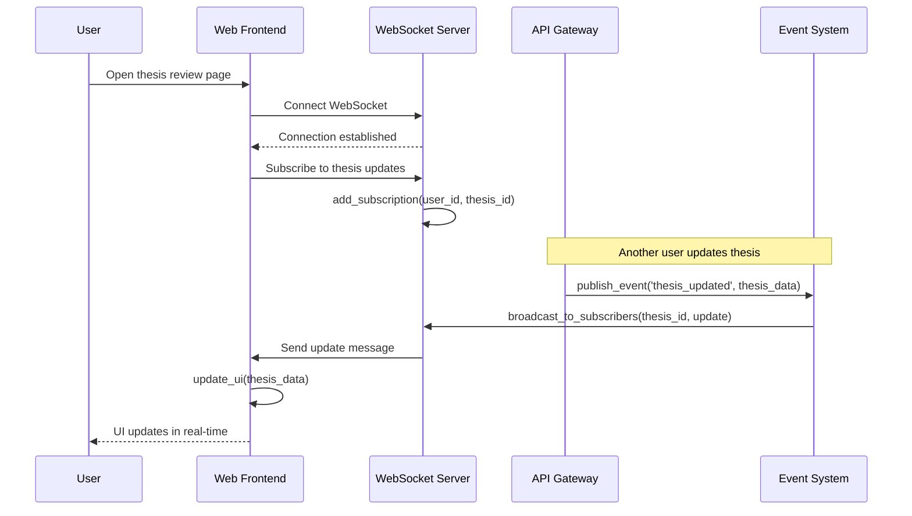
```mermaid
sequenceDiagram
    participant U as User
    participant W as Web Frontend
    participant WS as WebSocket Server
    participant API as API Gateway
    participant ES as Event System

    U->>W: Open thesis review page
    W->>WS: Connect WebSocket
    WS-->>W: Connection established
    W->>WS: Subscribe to thesis updates
    WS->>WS: add_subscription(user_id, thesis_id)
    
    Note over API,ES: Another user updates thesis
    API->>ES: publish_event('thesis_updated', thesis_data)
    ES->>WS: broadcast_to_subscribers(thesis_id, update)
    WS->>W: Send update message
    W->>W: update_ui(thesis_data)
    W-->>U: UI updates in real-time
```

## Security Workflows

### 1. Authentication Token Refresh

#### JWT Token Renewal
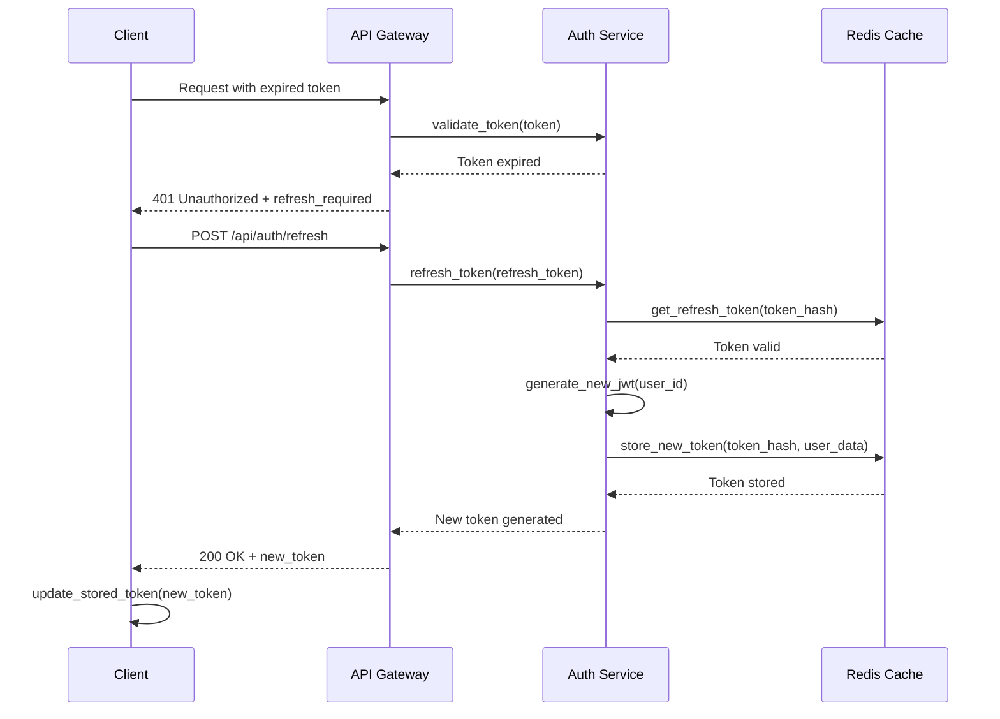
```mermaid
sequenceDiagram
    participant C as Client
    participant API as API Gateway
    participant AS as Auth Service
    participant Cache as Redis Cache

    C->>API: Request with expired token
    API->>AS: validate_token(token)
    AS-->>API: Token expired
    API-->>C: 401 Unauthorized + refresh_required
    
    C->>API: POST /api/auth/refresh
    API->>AS: refresh_token(refresh_token)
    AS->>Cache: get_refresh_token(token_hash)
    Cache-->>AS: Token valid
    AS->>AS: generate_new_jwt(user_id)
    AS->>Cache: store_new_token(token_hash, user_data)
    Cache-->>AS: Token stored
    AS-->>API: New token generated
    API-->>C: 200 OK + new_token
    C->>C: update_stored_token(new_token)
```

### 2. Authorization Check

#### Permission Validation
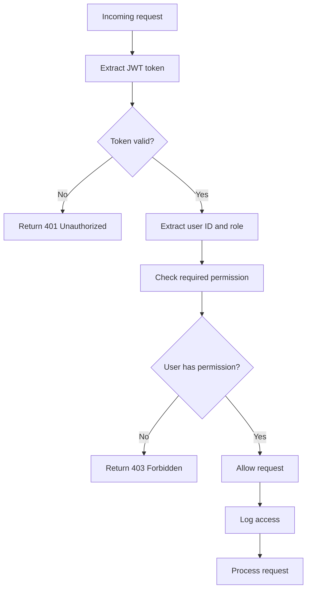
```mermaid
flowchart TD
    A[Incoming request] --> B[Extract JWT token]
    B --> C{Token valid?}
    C -->|No| D[Return 401 Unauthorized]
    C -->|Yes| E[Extract user ID and role]
    E --> F[Check required permission]
    F --> G{User has permission?}
    G -->|No| H[Return 403 Forbidden]
    G -->|Yes| I[Allow request]
    I --> J[Log access]
    J --> K[Process request]
```

## Monitoring and Observability

### 1. Request Tracing

#### Distributed Tracing Flow
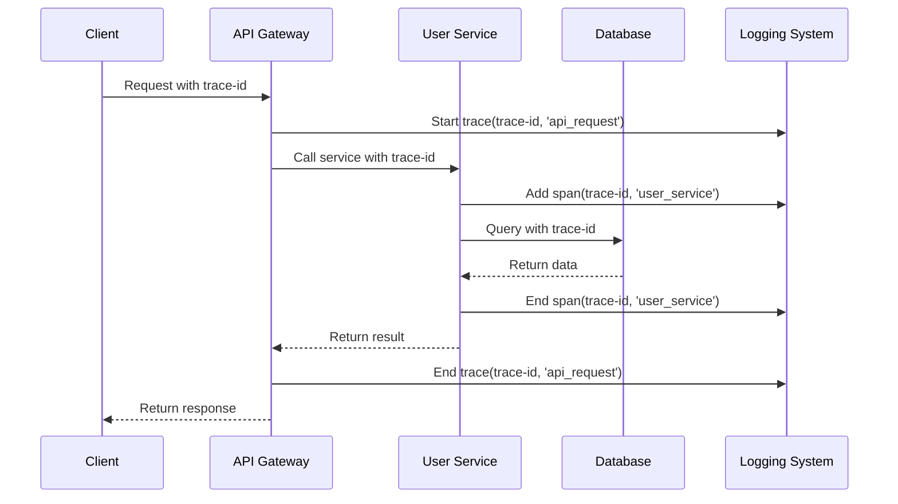
```mermaid
sequenceDiagram
    participant C as Client
    participant API as API Gateway
    participant US as User Service
    participant DB as Database
    participant Log as Logging System

    C->>API: Request with trace-id
    API->>Log: Start trace(trace-id, 'api_request')
    API->>US: Call service with trace-id
    US->>Log: Add span(trace-id, 'user_service')
    US->>DB: Query with trace-id
    DB-->>US: Return data
    US->>Log: End span(trace-id, 'user_service')
    US-->>API: Return result
    API->>Log: End trace(trace-id, 'api_request')
    API-->>C: Return response
```

### 2. Health Monitoring

#### System Health Check
```mermaid
flowchart TD
    A[Health check request] --> B[Check database connectivity]
    B --> C{DB healthy?}
    C -->|No| D[Mark as unhealthy]
    C -->|Yes| E[Check Redis connectivity]
    E --> F{Redis healthy?}
    F -->|No| D
    F -->|Yes| G[Check external services]
    G --> H{Services healthy?}
    H -->|No| D
    H -->|Yes| I[Mark as healthy]
    D --> J[Return 503 Service Unavailable]
    I --> K[Return 200 OK]
```

## Conclusion

The dynamic view of the Thesis Supervisor System reveals:

1. **Well-defined workflows** that handle complex business processes
2. **Robust error handling** with proper fallback mechanisms
3. **Efficient caching strategies** for optimal performance
4. **Real-time capabilities** for enhanced user experience
5. **Comprehensive security measures** at all interaction points
6. **Scalable architecture** that can handle growing user base
7. **Monitoring and observability** for operational excellence

These dynamic behaviors ensure the system meets its functional requirements while maintaining high performance, security, and reliability standards. 